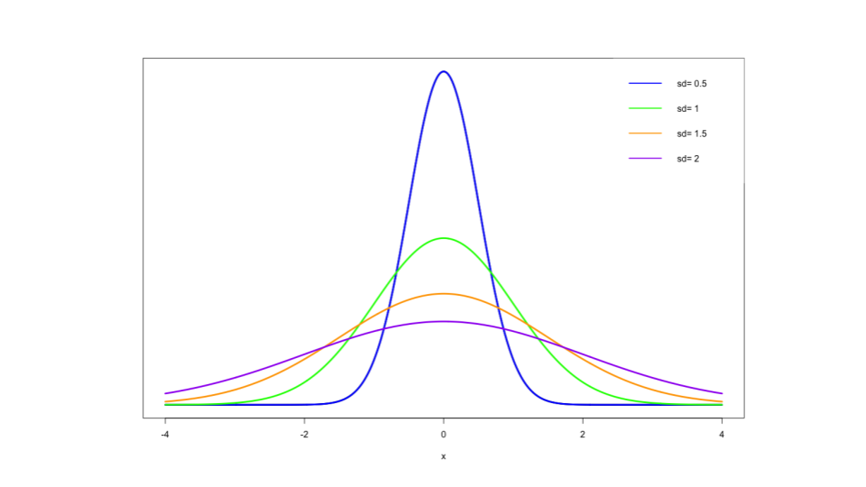

# Probability & Expected Values
In this module, we'll go over some information and resources to help you get started and succeed in the course. During this week, we'll focus on the fundamentals including probability, random variables, expectations.

## Introduction
Greetings and a warm welcome to the Probability class, which is a part of the Statistical Inference course within the Coursera Data Science series. I'm Brian Caffo, and I will be one of your instructors for this class. Alongside me, we have Jeff Leek and Roger Peng, who will also be co-teaching the course. We all belong to the Department of Biostatistics at the Bloomberg School of Public Health.
### Syllabus
The primary instructor of this class is Brian Caffo.
Brian is a professor at Johns Hopkins Biostatistics and co-directs the SMART working group.

This class is co-taught by Roger Peng and Jeff Leek. In addition, Sean Kross and Nick Carchedi have been helping greatly.

**Course Content**

In this course we will cover the following topics:
1. Probability
2. Conditional Probability
3. Expectations
4. Variance
5. Common Distributions
6. Asymptotics
7. T confidence intervals
8. Hypothesis testing
9.  P-values
10. Power
11. Multiple Testing
12. Resampling


If you'd prefer to watch the videos on YouTube, you can do so through this [link](https://www.youtube.com/playlist?list=PLpl-gQkQivXiBmGyzLrUjzsblmQsLtkzJ).


### Course Book: 
Statistical Inference for Data Science book is now available. It's a different sort of book published on LeanPub. If you purchase the book on LeanPub, you'll get all editions in the future for free. You pick the price on the site. You can get it [here](https://leanpub.com/LittleInferenceBook).

Following our style for the specialization, the book is creative commons licensed to offer you maximum flexibility in how you use the materials.

You can also just read a web page rendering of the book [here](https://leanpub.com/LittleInferenceBook/read)

In addition, the book is available on [GitHub](https://github.com/bcaffo/LittleInferenceBook) if you wish to render it yourself using pandoc.

### Github repository

The most up to date information on the course lecture notes will always be on the [Github repository](https://github.com/DataScienceSpecialization/courses/tree/master/06_StatisticalInference).

Please issue pull requests so that we may improve the materials. Notice that Brian's forked github repo is sometimes out of sync with the Data Science Specialization repo managed by the other instructors. Make sure to check in Brian's master repo for the most up to date material.

If you would just like the full set of lecture pdfs, grab them [here](https://github.com/bcaffo/courses/blob/master/06_StatisticalInference/lectures.zip?raw=true).


If you would just like the full set of Rmd files for the lecture code, get those [here](https://github.com/bcaffo/courses/blob/master/06_StatisticalInference/rmd.zip?raw=true).

### Homework Problems
In the book, there are homework problems fairly similar to the quiz questions.

If you can do them, you should be in very good shape for the quizzes. The homework assignments in this course are optional. They won't count toward your final grade, but they are a good opportunity to practice the skills covered in the course. There are worked out solutions on youtube linked to the book. These are ordered in an odd way, as the class has been restructured. So, it's probably best to just do them through the book.

[Homework 1](http://bcaffo.github.io/courses/06_StatisticalInference/homework/hw1.html#1)
[Homework 2](http://bcaffo.github.io/courses/06_StatisticalInference/homework/hw2.html#1)
[Homework 3](http://bcaffo.github.io/courses/06_StatisticalInference/homework/hw3.html#1)
[Homework 4](http://bcaffo.github.io/courses/06_StatisticalInference/homework/hw4.html#1)

### Differences of opinion
Keep in mind that currently data analysis is as much art as it is science - so we may have a difference of opinion - and that is ok! Please refrain from angry, sarcastic, or abusive comments on the message boards. Our goal is to create a supportive community that helps the learning of all students, from the most advanced to those who are just seeing this material for the first time.

### Data Science Specialization Community Site
Since the beginning of the Data Science Specialization, we've noticed the unbelievable passion students have about our courses and the generosity they show toward each other on the course forums. A couple students have created quality content around the subjects we discuss, and many of these materials are so good we feel that they should be shared with all of our students.

We're excited to announce that we've created a site using [GitHub Pages](http://datasciencespecialization.github.io/) to serve as a directory for content that the community has created. If you've created materials relating to any of the courses in the Data Science Specialization, please send us a pull request so we can add a link to your content on our site. You can find out more about contributing [here](https://github.com/DataScienceSpecialization/DataScienceSpecialization.github.io#contributing)

We can't wait to see what you've created and where the community can take this site!

## Probability
In today's lecture, we will cover the fundamentals of probability at a beginner's level, providing you with the necessary knowledge for your journey in the data science specialization. If you're interested in delving deeper into this topic, I highly recommend checking out my comprehensive mathematical biostatistics boot camp series. In addition,the course notes are on GitHub.


In this module we discuss probability, the foundation of statistical analysis. Probability assigns a number between 0 and 1 to events to give a sense of the "chance" of the event. Probability has become our default model for apparently random phenomena. Our eventual goal is to use probability models, our formal mechanism for connecting our data to a population. However, before we get to probability models, we need to understand the basics of probability calculus. The next few lectures cover these basics.

**Probability** = the study of quantifying the likelihood of particular events occurring
- given a random experiment, probability = population quantity that summarizes the randomness
This summary is not just about the data at hand, but a conceptual quantity that exist in the population that we want to estimate.

Let's delve into the concept of probability. In the context of a random experiment, such as rolling a die, probability quantifies the inherent randomness of the outcomes. It's important to highlight the term "population" here. When considering a die roll, probability is seen as an intrinsic characteristic of the die itself, rather than being dependent on a specific sequence of fixed rolls. Therefore, when we discuss probability, we're referring to a conceptual property that exists within the population we aim to estimate, rather than being directly observable in the data we have. Now, let's define the principles that govern probability, known as probability calculus. Firstly, probability operates on the potential outcomes of an experiment. For instance, when rolling a die, the possible outcomes could be 1, the set {1, 2}, the set of even numbers {2, 4, 6}, or the set of odd numbers {1, 3, 5}, and so on. Probability is a function that assigns a number between 0 and 1 to each of these sets of possible outcomes.
We must adhere to the rule that the probability of an event occurring, such as rolling the die and obtaining a particular number, must be equal to one. Additionally, the probability of the union of two mutually exclusive sets of outcomes must be equal to the sum of their individual probabilities. For example, consider the scenario where one possible outcome is obtaining either a one or a two, while another possible outcome is obtaining either a three or a four. These two sets, {1, 2} and {3, 4}, cannot occur simultaneously. The probability of the union, i.e., obtaining a one, two, three, or four, is the sum of the probabilities of obtaining a one or two, plus the sum of the probabilities of obtaining a three or four.

Interestingly, these simple rules encompass all the necessary principles to establish the general rules that govern probability. This significant discovery was made by the Russian mathematician Kolmogorov. Let's explore some of the essential rules that probability must abide by. While I have already mentioned a few, others naturally follow from the previously stated rules.

1. The probability of an event not occurring, or "nothing" happening, is zero. In the case of rolling a die, something is bound to occur, and you will obtain a number. 
2. Conversely, the probability of an event occurring, such as rolling a specific number on the die, is equal to one.
3. It is intuitive to understand that the probability of an event happening is equal to one minus the probability of the opposite event occurring. For example, the probability of rolling an even number on a die is equal to one minus the probability of rolling an odd number. This is because the set of odd numbers is considered the opposite of obtaining an even number in the context of rolling a die.
4. The probability of at least one of two or more mutually exclusive events, which cannot occur simultaneously, is the sum of their individual probabilities. This aligns with the definition we discussed earlier.
5. Another consequence of probability calculus is that if event A implies the occurrence of event B, then the probability of event A is less than or equal to the probability of event B. Although this may sound complex when explained verbally, it becomes clearer when visualized using a Venn diagram. 

<div class="figure" style="text-align: center">

<p class="caption">(\#fig:unnamed-chunk-1)Event A being sub section of B event</p>
</div>

In the diagram, event A is represented by a circle contained within event B. When we consider the probability of A, we assign a number to the area within circle A. Similarly, when discussing event B, we refer to the probability assigned to the entire circle, which includes the area of A. Therefore, it logically follows that the probability of B is larger than or equal to the probability of A. This concept is often intuitive and easily understood once visualized. For instance, the probability of rolling a 1 (set A) is less than the probability of rolling a 1 or a 2 (set B).

1. For any two events, the probability of at least one occurring is equal to the sum of their probabilities minus the probability of their intersection.

<div class="figure" style="text-align: center">

<p class="caption">(\#fig:unnamed-chunk-2)Events A and B with intersection</p>
</div>

Again, visualizing this with a Venn diagram helps in understanding it better. Consider set A and set B. When we add their individual probabilities, we are effectively adding the intersection region twice, once when considering A and once when considering B. Since we have counted the intersection twice, to obtain the probability of their union, we need to subtract the intersection once. This rule highlights that we cannot simply add probabilities if there exists a non-trivial intersection between the events.

Now, let's illustrate an example to demonstrate why we cannot simply add probabilities when the events are not mutually exclusive. According to the National Sleep Foundation, approximately 3% of the American population has sleep apnea, while around 10% of the North American and European population has restless leg syndrome. Let's assume, for the sake of argument, that these probabilities are derived from the same population.  The question is, can we add these probabilities together to conclude that about 13% of people in this population have at least one of these sleep problems? The answer is no. The reason is that these events, sleep apnea and restless leg syndrome, can occur simultaneously and are not mutually exclusive. There is a non-trivial portion of the population that experiences both conditions concurrently.

To elaborate further, let's define event A as the occurrence of sleep apnea in a person drawn from this population, and event B as the occurrence of restless leg syndrome. In this case, we believe that the intersection of these two events (the occurrence of both conditions) is non-trivial. If we were to naively add the probabilities of A and B, we would essentially count the intersection twice, which would result in an overestimate. To determine the probability of the union (at least one of the conditions), we need to subtract the intersection once, recognizing that it was mistakenly included twice in the initial addition.

### Probability mass functions and probability density functions
Probability calculus provides a valuable framework for understanding the fundamental rules that govern probability and serves as the basis for all probabilistic thinking. However, when it comes to numeric outcomes of experiments, we require a more practical approach. This is where densities and mass functions for random variables come into play, serving as a convenient starting point. These concepts will be sufficient for our purposes, which is collecting data that will be utilized to estimate properties of the population. 

One of the most well-known examples of a density function is the bell curve, also known as the normal distribution. In this class, you will gain a deeper understanding of what it truly means for data to follow a bell curve. You will learn about the significance and interpretation of the bell curve. Importantly, you will also realize that when discussing probabilities associated with the bell curve or the normal distribution, we are referring to population quantities, not statements solely based on the observed data.

Before delving into data analysis, it is crucial to develop our intuition for understanding population quantities. A random variable represents the numerical outcome of an experiment. In our study, we will encounter two types of random variables: discrete and continuous.
Discrete random variables are those that can be counted, such as the number of web hits or the possible outcomes of rolling a die. They can even include non-numeric attributes like hair color, which can be assigned numeric values (e.g., 1 for blonde, 2 for brown, 3 for black, etc.). For discrete random variables, we assign probabilities to each possible value they can take. On the other hand, continuous random variables can assume any value within a range or continuum. When working with continuous random variables, we assign probabilities to ranges of values they can take.

Let's consider some simple examples that can be viewed as random variables, as these examples will aid in building our intuition throughout the course. One prominent example is the flip of a coin, where we can assign values of "heads" or "tails" (or 0 and 1) to represent the outcomes. This is a discrete random variable since it can only take two distinct levels. Another example of a discrete random variable is the outcome of rolling a die. It can only take one of six possible values, making it a discrete random variable with simple probability mechanics. A more complex random variable would be, the amount of website traffic or the number of web hits on a given day. While we'll likely treat it as discrete, it's interesting because it doesn't have an upper bound. In such cases, we might employ the Poisson distribution to model it.
The hypertension status of a randomly selected subject from a population can also be a random variable. We may assign a value of 1 to indicate the presence of hypertension or a diagnosis, and 0 otherwise. This random variable would typically be modeled as discrete.

An example of continuous random variable would be measuring a subject's body mass index (BMI). In this case, BMI would be considered a continuous random variable, as it can assume any value within a range.
Intelligence quotients (IQ) are often modeled as continuous random variables.

When working with discrete random variables, we assign a probability to each possible value they can take. We represent this assignment using a function called the probability mass function (PMF). The PMF takes any value of the discrete random variable and assigns the probability of it taking that specific value.

For example, in the case of a die roll, the PMF would assign a probability of one-sixth to the value one, one-sixth to the value two, one-sixth to the value three, and so on.

To ensure that the PMF satisfies the basic rules of probability, we have two requirements. First, the PMF must always be greater than or equal to zero since probabilities range from zero to one, inclusive. Second, the sum of the probabilities assigned to all possible values of the random variable must add up to one. In the case of a die roll, if we add the probabilities of getting one, two, three, four, five, and six, the sum should equal one. This ensures that the probability of any possible outcome occurring is accounted for.

Therefore, the PMF of a discrete random variable must adhere to these two rules to accurately represent probabilities.

We will primarily focus on using probability mass functions (PMFs) that are particularly useful in our context. Two examples of such PMFs are the binomial distribution, commonly used for coin flips, and the Poisson distribution, commonly used for counting events. However, let's discuss one of the most well-known PMFs, the Bernoulli distribution, which is often used to model the outcome of a coin flip.

Let's denote the random variable representing the coin flip outcome as capital X, where X = 0 represents tails and X = 1 represents heads. In this notation, an uppercase letter represents a potential value of the random variable that may or may not occur. On the other hand, a lowercase x serves as a placeholder for a specific value that we will substitute.

The PMF for the Bernoulli distribution is represented as $P(X) = (0.5)^{x} * (0.5)^{(1-x)}$. When we substitute x = 0 into this PMF, we obtain a probability of one-half. Similarly, when we substitute x = 1, we also get a probability of one-half. This means that the probability of the random variable X taking the value 0 is one-half, and the probability of it taking the value 1 is also one-half.

When we introduce an unfair coin, we can adjust our approach by considering a parameter, theta, representing the probability of getting a head. The probability of getting a tail would then be 1 minus theta, where theta is a number between 0 and 1. In this case, the probability mass function can be written as follows: $$P(X) = \theta^x * (1 - \theta)^{(1 - x)}$$.
By substituting x = 1 into this PMF, we obtain the probability $\theta$. Similarly, when we substitute x = 0, we get the probability $1-\theta$. This implies that for this population distribution, the probability of the random variable X taking the value 0 is $1-\theta$, and the probability of it taking the value 1 is $\theta$.

This approach is particularly useful for modeling the prevalence of a certain condition or event. For instance, if we want to model the prevalence of hypertension, we can assume that the population or sample we are studying can be likened to the outcomes of biased coin flips with a success probability represented by $\theta$. However, the challenge lies in not knowing the exact value of $\theta$. Therefore, we will utilize our data to estimate this proportion within the population.

In contrast to the probability mass function, which assigns probabilities to specific values for discrete random variables, the probability density function (PDF) is associated with continuous random variables. Similar to the rules that the probability mass function follows, a valid probability density function must satisfy two specific rules: it must be greater than or equal to zero everywhere, and the total area under the function must be equal to one. The key concept of a probability density function is that areas under the curve correspond to probabilities for the random variable. For instance, if we state that intelligence quotients (IQ) are normally distributed with a mean of 100 and a standard deviation of 15, we are implying that the population follows a bell-shaped curve. In this case, the probability that a randomly selected individual from that population has an IQ between 100 and 115 is represented by the area under the curve within that range. It is important to note that the probability density function represents a statement about the population of IQs and not the data itself. The data will be used to assess and evaluate the assumptions made about the population's probability distribution. It is worth emphasizing that whenever the term "probability" is used, it refers to a population quantity.

<div class="figure" style="text-align: center">

<p class="caption">(\#fig:unnamed-chunk-3)Area between 100-115 IQ under normal distribution</p>
</div>

It is interesting to note that when we model continuous probabilities using probability density functions (PDFs) for continuous random variables, the probability of the variable taking any specific value is actually *zero*. This is due to the fact that the area under a line, which represents a single point, is zero. However, this does not pose a problem and is simply a quirk arising from modeling random variables with infinite precision. It does not affect the functioning of probability calculations.

The bell-shaped curve, which represents a normal distribution, can be quite challenging to work with until you learn the appropriate techniques, which will be covered in a separate lecture. For now, let's consider a simpler density function that resembles a right triangle. We'll use the function $f(x) = 2x$ for x between 0 and 1, and 0 otherwise, as an example. Let's provide some context for this function: imagine it represents the proportion of help calls that are addressed in a random day by a helpline.

<div class="figure" style="text-align: center">

<p class="caption">(\#fig:unnamed-chunk-4)Shape of the density function for f(x)=2x</p>
</div>

What does this density function imply? It means that the probability of the number of calls being addressed falling between 20% and 60% of the total calls for that day is given by the area under the curve in that range. Now, let's evaluate whether this function is a mathematically valid probability density function.

Looking at the plot of the PDF, which resembles a right triangle, we can see that it is always greater than or equal to zero. Next, let's calculate the area under the curve. Since it is a right triangle, the area is equal to half the base (which is 1) multiplied by the height (which is 2). Thus, the area is 1. Therefore, this function satisfies the requirements of a valid probability density function, as it is always non-negative and the total area under the curve is equal to 1.

Example: we want to find the probability that 75% or fewer calls get addressed in a randomly sampled day from this population. At the point (0.75, 1.5) on the density function, the height is 1.5 because the function is defined as 2 times x. The base value is 0.75. To calculate the probability, we divide the area, which is half the base times the height, by 2. So the probability turns out to be 56%, as shown in the example.

<div class="figure" style="text-align: center">

<p class="caption">(\#fig:unnamed-chunk-5)Shape of the density function for f(x)=2x</p>
</div>

Interestingly, this density function is a special case of a well-known distribution called the $\beta$ distribution. I have provided the R code here for obtaining the probability directly from the $\beta$ distribution. Although in this simple case we don't need it because we are working with triangles, in more complex scenarios, we will require these functions. It's worth mentioning that in R language we can right this as `pbeta(0.75,2,1)` the `p` prefix before a function denotes the calculation of probabilities,  1 define the specific triangle we are using in this example, and you can test and see that it yields the same result of 56%. Certain areas of the density are so commonly used that they are given specific names. For instance, the cumulative distribution function (CDF) of a random variable X gives the probability that X is less than or equal to a given value x. 
$$F(x) = P(X \leq x)$$
This definition holds for both discrete and continuous random variables. In the case of the beta distribution we just examined, the `pbeta` function in R always returns the probability of being less than or equal to the first argument provided.

Alternatively, the survival function is another useful concept. It is defined as 1 minus the cumulative distribution function and represents the probability of a random variable being greater than a given value. 
$$S(x) = P(X > x) = 1 - F(x)$$
Suppose we wanted to determine the cumulative distribution function for the previously mentioned density. For instance, we might want to find the probability that 40% or fewer, 50% or fewer, or 60% or fewer of the calls get answered in a given day based on this specific right triangle population density function. In each case, the calculation will resemble what we did earlier for 0.75. Since the density function is a right triangle, the probability is half the area of the base times the height. This simplifies to one-half times x times 2x, which equals $x^2$. Therefore, the function $x^2$ provides the probability of that percentage or fewer calls being answered on a randomly sampled day.

To examine the results when we use the `pbeta` function, which corresponds to the cumulative distribution function in R, for the three values mentioned earlier, we can write the followings. 

`pbeta(c(0.4,0.5,0.6),2,1)` where parameters 2 and 1 are utilized to evaluate the specific $\beta$ density, yielding probabilities of 16%, 25%, and 36%. Therefore, the probability that 40% or fewer of the calls get answered on a given day is 16%, the probability that 50% or fewer get answered is 25%, and the probability that 60% or fewer get answered is 36%. In terms of the survival function, it is simply 1 minus the cumulative distribution function, which can be expressed as 1 minus $x^2$.

As we progress, we will encounter more complex density functions. However, the process will be simpler since we can rely on existing functions such as `pnorm` and `pbeta` instead of calculating them directly.

### Quantiles
You're already familiar with sample quantiles, such as the 95th percentile, which represents the 0.95 quantile of a dataset. If you score at the 95th percentile on an exam, it means that 95% of the students scored worse than you while 5% scored better. Now, let's introduce the concept of population analogs for quantiles. In the case of the 95th percentile or the 0.95 quantile, you would order the observations from least to greatest and locate the point or exam score below which 95% of the observations lie. This point is denoted as $x_\alpha$, where alpha corresponds to the quantile. In other words, it satisfies the condition $F(x_\alpha) = \alpha$, where F is the distribution function. To better understand this concept, let's try to visualize it.

Let's consider the distribution function $F(x)$, which represents the area below point x on a density plot. This area corresponds to the probability that a random variable from the population is less than or equal to x.  As an example let's imagine a population of test scores, an infinite population of students. The distribution function gives us the probability of obtaining a score equal to or lower than x for a randomly selected student from this population.

Now, let's introduce the concept of the $\alpha^{th}$ quantile. We move a line along the distribution until we find the point $x_\alpha$, where exactly $\alpha$ proportion of the probability lies below it. This is similar to what we do with our data when finding an empirical quantile, where we locate the data point such that, for example, 95% of the test scores lie below it, which corresponds to the sample $95^{th}$ percentile. In the population distribution, we move the x point until we find the point where the probability of being below it is 95%. Percentiles are essentially quantiles with alpha expressed as a percentage rather than a proportion. The median, often the most well-known quantile, represents the 50th percentile.

<div class="figure" style="text-align: center">

<p class="caption">(\#fig:unnamed-chunk-6)95 percentile of a distribution</p>
</div>

Quantiles are frequently used, particularly with the normal distribution. However, we rarely need to directly work with densities to calculate quantiles, as the distributions we commonly encounter have well-defined quantiles. In R, we can easily find quantiles using the `q` prefix before the density function name. For example, for the $\beta$ density we discussed earlier, the function `qbeta` gives us the relevant quantile. We can input 0.5 (`qbeta(0.5,2,1)`)to find the median, considering that R expects the quantile argument as a proportion rather than a percentage, i.e. 0.5 is acceptable and 50 for 50% is not acceptable. The parameters 2 and 1 are specific to the density we're working with, which you'll have to trust me on for now. When we calculate the quantile using `qbeta` with 0.5 as the argument, we obtain the same result as before, 0.7 or 0.71. 

 At this point, you might be wondering why the concept of the median seemed simpler before, when you would order observations and select the middle value or averaging the two middle values for an even number of observations.

The answer is there you had an estimator. However, in this class, we aim to go beyond just estimators and focus on the targets of estimation, known as estimands. In the case of the sample median, it estimates the population median. 

To understand this, let's consider an example where we sample a few days and calculate the percentage of calls answered on those days. If we line up these percentages in ascending order, the middle value represents the *sample median*. We can think of this sample median as an estimator for the true median percentage of calls answered in the population. However, to establish a connection between the sample and the population, we need to make certain assumptions, which we will thoroughly explore and formalize in this class.

In essence, for every estimator, there exists an estimand in this class. The sample mean estimates the population mean, the sample median estimates the population median, and the sample standard deviation estimates the population standard deviation, and so on. This process is known as *statistical inference*, where we link our sample data to the underlying population.

## Conditional probability
Conditional probability is a very intuitive idea, "What is the probability given partial information about what has occurred?". To illustrate the concept of conditioning, let's consider [XKCD comic](https://xkcd.com/795/). The comic portrays two individuals standing in a field during a lightning storm near a tree. One person suggests going inside, but the other dismisses the idea, citing the low chance of getting struck by lightning, approximately one in seven million. However, the comic humorously points out that the death rate among people who know this statistic is one in six. The underlying message is that the second person has failed to consider the additional information available to them, leading to an incorrect assessment of risk. 

Consider another example to better understand conditional probabilities. Suppose we have a standard die, and the probability of rolling a one is assumed to be $\frac{1}{6}$. However, if we are given the extra information that the roll resulted in an odd number (one, three, or five), our perspective changes. Now, conditioned on this new information, we would no longer say that the probability of rolling a one is $\frac{1}{6}$. Instead, we would consider the one, three, and five to be equally likely outcomes, so the probability of rolling a one becomes $\frac{1}{3}$. This demonstrates how conditional probabilities adjust our understanding based on additional information.

To define conditional probability, suppose we have an event B with a nonzero probability. Then, the conditional probability of event A given that B has occurred is denoted as $P(A|B)$ and is defined as:
$$P(A|B) = \frac{P(A \cap B)}{P(B)}$$ 
In the case where A and B are statistically independent events (*we will define this later*), the conditional probability simplifies to the probability of A. This means that if the occurrence of event B provides no new information about event A, the probability of A remains unchanged.

Let's verify that the concept of conditional probability aligns with our intuition in the example of rolling a die. Event B represents the occurrence of an odd number (one, three, or five), and event A represents rolling a one. We want to find the $P(A|B)$. In other words, we are interested in the probability of rolling a one when we know that the outcome is an odd number. Using the definition of conditional probability, $$P(A|B) = \frac{P(A \cap B)}{P(B)}$$. Since A is entirely contained within B, the probability of A ∩ B is simply the probability of A, which is $\frac{1}{6}$. The probability of B, in this case, is $\frac{3}{6}$ that is $\frac{1}{6}$ for each of the three mutually exclusive possibilities. Thus, the conditional probability $P(A|B)$ equals ${\frac{1}{6}}$ divided by ${\frac{3}{6}}$, which simplifies to $\frac{1}{3}$, confirming our previous understanding.

Conditional probability allows us to update our probabilities based on new information, and it plays a **crucial** role in statistical inference.
### Bayes' rule
One of the well-known applications of conditional probability is Bayes' rule, named after Thomas Bayes, a Presbyterian minister whose work was published posthumously. Bayes' rule allows us to reverse the conditioning set and the set we are interested in finding the probability of. Suppose we want to calculate the probability of event B given event A, and we already know or can easily calculate the probability of event A given event B. Bayes' rule enables us to evaluate the probability of B given A in terms of the probability of A given B. 
$$P(B|A) = \frac{P(A|B) * P(B)}{P(A|B) * P(B)+P(A|B^c)*P(B^c)}$$
However, to apply Bayes' rule, we also need the marginal probability of event B, which is valuable in various contexts such as diagnostic tests.

Conditional probability in the context of a diagnostic test, exemplifies one of the significant applications of conditional probability and Bayes' rule. Consider a test for a disease, where we define plus(+) and minus(-) as events representing a positive or negative test result, respectively. D and $D^c$ represent the events of having or not having the disease, respectively. The sensitivity of the test is the probability that the test is positive given that the subject actually has the disease. A high sensitivity indicates a good test. The specificity, on the other hand, is the probability that the test is negative given that the subject does not have the disease. A high specificity is desirable for a good test. While obtaining accurate estimates of sensitivity and specificity can be challenging, in certain cases, like an HIV blood test, it is possible to test individuals known to have or not have the disease to estimate these probabilities.

When a diagnostic test is positive, the probability of having the disease given the positive test result (positive predictive value) is of particular interest. Similarly, when the test is negative, the probability of not having the disease given the negative test result (negative predictive value) becomes relevant. In the absence of a test, the probability of having the disease is known as the prevalence of the disease.

Here is an example to illustrate the calculation of positive predictive value using Bayes' rule. Suppose a study comparing the efficacy of an HIV test reports sensitivity as 99.7% and specificity as 98.5%. These numbers are for illustrative purposes and do not reflect actual HIV test statistics. Now, consider a subject from a population with a 0.1% prevalence of HIV who receives a positive test result. We want to calculate the associated positive predictive value.

Applying Bayes' rule, we have the probability of disease given a positive test result $P(D|+)$ equal to the probability of a positive test result given disease $P(+|D)$ multiplied by the probability of disease $P(D)$, divided by the denominator. To simplify, we express the probability of a positive test result given no disease as $1-P(-|D^c)$ and the probability of no disease as $1-P(D)$. Substituting known values, we find the positive predictive value to be 6% for this test in the given population. The low positive predictive value is primarily due to the low prevalence of the disease. However, in a counseling scenario, if the counselor discovers that the subject is an intravenous drug user who regularly has intercourse with an HIV-infected partner, the counselor would consider a much higher prevalence for this particular individual, leading to a higher positive predictive value.

Bayes' rule provides a powerful framework for incorporating new information and adjusting probabilities based on conditional events, making it valuable in various fields, including diagnostics and decision-making.
We want to distinguish between two components: the component that is dependent on the prevalence and the component that is objective evidence of the positive test result. This is where diagnostic likelihood ratios(DLR) come into play, and we'll explore them further. First, let's revisit the formula for positive predictive value in Bayes' rule, which depends on sensitivity, specificity, and disease prevalence. 

$$P(D|+) = \frac{P(+|D)P(D)}{P(+|D) P(D) + P(+|D^c) P(D^c)}$$

We can apply a similar approach to calculate the probability of not having the disease given a positive test result.
$$P(D^c|+) = \frac{P(+|D^c)P(D^c)}{P(+|D) P(D) + P(+|D^c) P(D^c)}$$
By dividing these two equations, we arrive at the odds of disease given a positive test result divided by the odds of not having the disease given a positive test result. 
$$\frac{P(D|+)}{P(D^c|+)} = \frac{P(+|D)P(D)}{P(+|D^c)P(D^c)}$$
post test odds of $D_{+}$= $DLR_{+}$ * pre test odds of D
Dividing a probability by 1 minus that probability gives us the **odds**. Therefore, on the left side, we have the odds of disease given a positive test result, while on the right side, we have the odds of disease without the test result. The factor in the middle represents the diagnostic likelihood ratio for a positive test result.
The equation can be expressed as follows: the pretest odds of disease multiplied by the diagnostic likelihood ratio equals the post-test odds of disease. In other words, the diagnostic likelihood ratio of a positive test result indicates how much the odds change when multiplied by it, transitioning from pretest to post-test odds. 

Returning to our example,  assume a subject has a positive HIV test. Using the sensitivity and specificity values mentioned earlier, the diagnostic likelihood ratio is calculated as $0.997$ divided by $1-0.985$, resulting in $66$. Regardless of the pretest odds, multiplying them by 66 gives the post-test odds. Thus, the hypothesis of disease is 66 times more supported by the data compared to the hypothesis of no disease. Even if the pretest odds are initially small, multiplying them by 66 will still yield a larger but still small number.

Now, consider the scenario when a subject receives a negative test result using the $DLR_{-}$. In this case, the $DLR_{-}$, derived from the sensitivity and specificity values mentioned earlier, is 0.003. 
$$DLR_{-}=\frac{1-0.997}{0.985}≈0.003$$
Consequently, the post-test odds of disease in light of a negative test result become 0.3% of the pretest odds of disease. Stated differently, the hypothesis of disease is supported 0.003 times the hypothesis of no disease given the negative test result.
By incorporating diagnostic likelihood ratios, we can assess the impact of a test result on the odds of disease and gain insights into the strength of evidence provided by the test.

### Independence
As mentioned earlier, event A is considered independent of event B if the probability of A given B is equal to the probability of A, given that event B has a positive probability. Another definition of independence states that events A and B are independent if the probability of their intersection $P(A \cap B)$ equals the product of their individual probabilities. This leads us to an important lesson: we cannot simply multiply probabilities without considering the independence of the events involved. Multiplication of probabilities is valid only for independent events.

Example: What is the probability of getting two consecutive heads when flipping a fair coin? We define event A as the probability of getting a head on the first flip and event B as the probability of getting a head on the second flip. Both probabilities are 0.5 since we assume a fair coin. In this case, because the events are independent, the probability of $P(A \cap B)$ (getting heads on both flips) is the product of their probabilities, which is 0.25. This calculation is straightforward and correct.
However, problems arise when people multiply probabilities in situations where they shouldn't. A notable example of incorrectly multiplying probabilities was reported in volume 309 of Science. It involved a physician who gave expert testimony in a criminal trial. The trial concerned a mother whose two children had died from sudden infant death syndrome (SIDS). The expert testimony multiplied the prevalence of SIDS (1 out of 8,500) by itself to calculate the probability of two children from the same mother having SIDS. Based on this evidence, among other factors, the mother was convicted of murder. The fundamental mistake in this case was multiplying probabilities for events that were not necessarily independent. It is reasonable to assume that events within families, such as the occurrence of SIDS, are dependent due to genetic or familial environmental factors.

In our class, we will primarily use the concept of independence by assuming that a collection of random variables are independent and identically distributed (IID). This means that the random variables are independent from each other and follow the same probability distribution. For example, several coin flips can be considered IID because each flip is independent of the others, and they all follow the same distribution with a 0.5 probability for heads and 0.5 for tails. IID sampling serves as our default model for a random sample. Even if we do not have an actual random sample, we often use the conceptual model of random sampling or IID to analyze our data. It will be the principal mode of analysis in this class. 

## Expected values
The empirical average is a very intuitive idea; it's the middle of our data in a sense. But, what is it estimating? We can formally define the middle of a population distribution. This is the expected value. Expected values are very useful for characterizing populations and usually represent the first thing that we're interested in estimating.

Now, we will discuss the process of drawing conclusions about populations based on noisy data obtained from them. We will assume that the populations and the randomness governing our samples are described by probability density functions and probability mass functions. Instead of focusing on the entire function, we will examine characteristics of these distributions that are reflected in the random variables drawn from them. The most valuable such characteristics are expected values, particularly the mean. The mean represents the center of a distribution. As the mean shifts, the distribution moves either to the left or right.

<div class="figure" style="text-align: center">

<p class="caption">(\#fig:unnamed-chunk-7)Mean of a distribution</p>
</div>

Another important characteristic is variance, which measures the spread of a distribution. 
<div class="figure" style="text-align: center">

<p class="caption">(\#fig:unnamed-chunk-8)Variance of a distribution</p>
</div>
Similar to how sample quantiles estimate population quantiles, sample expected values estimate population expected values. Therefore, the sample mean serves as an estimate of the population mean, the sample variance estimates the population variance, and the sample standard deviation approximates the population standard deviation.

The expected value, or mean, of a random variable represents the center of its distribution. For a discrete random variable x with a probability mass function $p(x)$, the expected value is calculated by summing the possible values that x can take multiplied by their respective probabilities. 
$$E[X]=\sum_{x} xp(x)$$
Conceptually, the expected value draws inspiration from the idea of the physical center of mass, where the probabilities act as weights and x represents the location along an axis. To illustrate this notion of center of mass, consider the sample mean. Even though we are focusing on the population mean in this discussion, it is interesting to note that the sample mean can be seen as the center of mass if we treat each data point as equally likely. In other words, each data point $x_i$ is assigned a probability of $\frac{1}{N}$, where N is the sample size. Intuitively, we employ this center of mass idea when using the sample mean.

To demonstrate this concept, I have provided some code that calculates the sample mean of a dataset and depicts it as the center of mass by generating a histogram. The example employs a dataset from R called "Galton," which consists of paired data representing the heights of parents and their children. 


```r
library(reshape2)
library(UsingR)
library(ggplot2)
data(galton)
longGalton <- melt(galton, measure.vars = c("child", "parent"))
g <- ggplot(longGalton, aes(x = value)) + geom_histogram(aes(y = ..density..,  fill = variable), binwidth=1, colour = "black") + geom_density(size = 2)
g <- g + facet_grid(. ~ variable)
g
```
The histogram displays the child's height distribution, and a continuous density estimate is superimposed. 

<div class="figure" style="text-align: center">

<p class="caption">(\#fig:unnamed-chunk-10)Height distribution for Childran and Parents</p>
</div>

To further explore this concept, we can use the "manipulate" function available in RStudio. By manipulating the mean value, we can observe how it balances out the histogram.


```r
library(manipulate)
library(UsingR)
library(ggplot2)
data(galton)

myHist <- function(mu){
    g <- ggplot(galton, aes(x = child))
    g <- g + geom_histogram(fill = "salmon", 
      binwidth=1, aes(y = ..density..), colour = "black")
    g <- g + geom_density(size = 2)
    g <- g + geom_vline(xintercept = mu, size = 2)
    mse <- round(mean((galton$child - mu)^2), 3)  
    g <- g + labs(title = paste('mu = ', mu, ' MSE = ', mse))
    g
}
manipulate(myHist(mu), mu = slider(62, 74, step = 0.5))
```
You can use the slider to move the mean value and observe how it affects the mean squared error.
<div class="figure" style="text-align: center">

<p class="caption">(\#fig:unnamed-chunk-12)Height distribution for Childran</p>
</div>

The mean squared error is a measure of imbalance, indicating how stable or unsteady the histogram appears. As we move the mean closer to the center of the distribution, the mean value increases, while the mean squared error decreases, signifying a better balance. However, if we move the mean too far from the center, the mean squared error increases again, indicating increased imbalance. This demonstration illustrates that the empirical mean serves as the balancing point for the empirical distribution, and we will utilize this concept when discussing the population mean, which serves as the balancing point for the population distribution.

Example: Suppose we flip a fair coin, and we assign the value 0 to tails and the value 1 to heads. What is the expected value of X? 
Again, the expected value represents a property of the population. By plugging the values into our formula, we calculate the expected value of X as follows:
$$E[X]=\sum_{x} xp(x)=0*0.5+1*0.5=0.5$$

When we compute this expression, we find that the expected value of X is 0.5. It's interesting to note that the expected value is a value that the coin itself cannot actually take. However, from a geometric perspective, the answer becomes quite obvious. If we visualize the coin's values as two bars of equal height, one at 0 and the other at 1, we can easily determine the balancing point by placing our finger exactly at 0.5.

<div class="figure" style="text-align: center">

<p class="caption">(\#fig:unnamed-chunk-13)Expected value of a coin flip</p>
</div>

Example: A random variable X represents the outcome of a biased coin flip. The probability of obtaining heads is denoted as $p$, while the probability of obtaining tails is $1-p$. What is the expected value of X in this case? 
By directly applying the formula, we multiply the value 0 by the probability $1-p$ and add it to the value 1 multiplied by the probability $p$. The result simplifies to $p$. Therefore, the expected value of a coin flip, even when the coin is biased, corresponds to the true long-run proportion of obtaining heads in an infinite number of coin flips.

Example: Suppose we roll a fair six-sided die, and X represents the number that appears face up. What is the expected value of X? 
Here, we take the values 1, 2, 3, 4, 5, and 6 and multiply each by the corresponding probability of the random variable X taking those values (each value has a probability of $\frac{1}{6}$). When we perform this calculation, we find that the expected value of X is 3.5. Once again, this is a value that the die itself cannot actually show.

<div class="figure" style="text-align: center">

<p class="caption">(\#fig:unnamed-chunk-14)Expected value of a die roll</p>
</div>

Similar to the coin example, the geometric argument makes it evident. We have six bars, each with a height of $\frac{1}{6}$, representing the possible outcomes of the die. If we were to balance them, it becomes clear that the balancing point would be at 3.5.
### Expected values for PDFs
When dealing with continuous random variables, it can be helpful to imagine cutting out the shape of probability density on a piece of wood and determining where you would place your finger to balance it out. This concept aligns with the notion of the center of mass of a continuous body. In the case of probability mass functions, as the bars representing the probabilities become narrower and smaller, we can visualize their balancing point.

Example: Suppose we have a density that ranges from zero to one, and the question arises: Is this a valid density?
The answer is yes; it corresponds to a well-known density called the **Uniform density**. Now, what is its expected value? 
If we were to cut this density out of a piece of wood and balance it, the position where we would place our finger to achieve balance is precisely at 0.5. This aligns perfectly with the expected value of the uniform density.

<div class="figure" style="text-align: center">

<p class="caption">(\#fig:unnamed-chunk-15)Uniform density</p>
</div>

It's crucial to understand that expected values represent properties of the distribution. They serve as the center of mass of a distribution. Additionally, it's important to note that the average of random variables is, in itself, a random variable. For example, if we roll six dice and calculate their average, the resulting value is a random variable. By repeatedly sampling from this average through multiple dice rolls, we generate a distribution that also possesses an expected value. The center of mass of this distribution coincides with the center of mass of the original distribution.

This topic becomes highly relevant to the field of inference, so let's explore some simulation examples to gain a better understanding. 

<div class="figure" style="text-align: center">

<p class="caption">(\#fig:unnamed-chunk-16)Simulation example</p>
</div>

In the first example, the blue density represents the outcome of numerous simulations based on a standard normal distribution. Due to the large number of simulations, this density provides a reliable approximation of the true distribution. It shows that collecting ample data from a population allows us to approximate its originating distribution effectively. The center of mass of this distribution, which would achieve balance, is located at zero.

Now, let's shift our focus to simulating the average of ten standard normals. By repeatedly performing this process and plotting the resulting histogram or density estimate, we obtain a different distribution. It no longer represents the distribution of standard normals; rather, it illustrates the distribution of averages of ten standard normals. This new distribution, represented by the salmon-colored plot, exhibits interesting properties. Notably, it is concentrated around zero, and this aligns with our previous point. The distribution of averages from a population tends to be centered at the same location as the distribution of the original population itself.

Although calculations and simulations can help us grasp these concepts conceptually, we can observe this phenomenon without explicitly performing them. Imagine rolling a die thousands of times and plotting a histogram of the results. In this case, approximately $\frac{1}{6}$ of the rolls would occur for each number from one to six. As we increase the number of rolls, these bars would eventually balance out. The center of mass for this distribution, which would achieve balance, is 3.5 (not exactly, given the finite number of rolls, but in theory, it would converge to 3.5 with an infinite number of rolls).

<div class="figure" style="text-align: center">

<p class="caption">(\#fig:unnamed-chunk-17)Die roll simulation</p>
</div>

Consider the scenario where we roll the die twice and calculate the average of the numbers obtained. If we repeat this process multiple times and create a distribution of these averages, we see a different pattern in the second panel. It appears more Gaussian in shape (we'll discuss this further later), and importantly, it is centered at the same location as before.

<div class="figure" style="text-align: center">

<p class="caption">(\#fig:unnamed-chunk-18)Coin toss average</p>
</div>

The population mean of averages of two die rolls is identical to the population mean of individual die rolls. This concept applies to other scenarios as well. For instance, if we were to flip a coin numerous times, we would expect approximately 50% of the outcomes to be zero (tails) and 50% to be one (heads). These proportions would converge to balance at around 0.5. When flipping the coin only a few times, the observed sample proportion may deviate from 0.5. However, as we increase the number of flips, the simulation variability becomes insignificant, and the proportion approaches 0.5.

If we flip the coin ten times, calculate the average, and repeat this process multiple times. This simulation provides insights into the distribution of averages of ten coin flips. We can extend this analysis to averages of 20 coin flips and averages of 30 coin flips. In each case, we observe that as the average incorporates more coin flips, the distribution becomes more concentrated around the mean. Nevertheless, regardless of the number of coin flips involved, the distribution of averages is consistently centered at 0.5.

To summarize the key points covered thus far: 

- Expected values are inherent properties of distributions. The population mean represents the center of mass of that population, and any movement in the mean would correspondingly shift the distribution.
- The sample mean represents the center of mass of the observed data. It serves as an estimate of the population mean and is considered unbiased.
- The population mean of the distribution of sample means precisely matches the population mean it aims to estimate. This understanding is vital as it allows us to estimate the population distribution accurately when collecting substantial amounts of data.
- We must recognize that while we obtain only one sample mean from our data, knowing the properties associated with sample means is immensely valuable.
- As more data contributes to the sample mean, the density mass function becomes more concentrated around the population mean. We also observe that, even in cases such as coin flipping and dice rolling, the distribution tends to exhibit Gaussian-like characteristics. We'll explore these concepts further in subsequent lectures.

## Practical R Exercises in swirl
During this course we'll be using the [swirl](http://swirlstats.com/) software package for R in order to illustrate some key concepts. The swirl package turns the R console into an interactive learning environment. Using swirl will also give you the opportunity to construct and explore your own regression models. In this programming assignment, you'll have the opportunity to practice some key concepts from this course.

Since swirl is an R package, you can easily install it by entering a single command from the R console:

```r
install.packages("swirl")
```
If you've installed swirl in the past make sure you have version 2.2.21 or later. You can check this with:

```r
packageVersion("swirl")
```
Every time you want to use swirl, you need to first load the package. From the R console:

```r
library(swirl)
```
Install the Statistical Inference course
swirl offers a variety of interactive courses, but for our purposes, you want the one called Statistical Inference. Type the following from the R prompt to install this course:

```r
install_from_swirl("Statistical Inference")
```
Start swirl and complete the lessons
Type the following from the R console to start swirl:

```r
swirl()
```
Then, follow the menus and select the Statistical Inference course when given the option. For the first part of this course you should complete the following lessons:

- Introduction
- Probability1
- Probability2
- ConditionalProbability
- Expectations

If you need help...

- Visit the [Frequently Asked Questions](https://github.com/swirldev/swirl/wiki/Coursera-FAQ) (FAQ) page to see if you can answer your own question immediately.
- Search the Discussion Forums this course.
- If you still can't find an answer to your question, then create a new thread under the swirl Programming Assignment sub-forum and provide the following information:
  - A descriptive title
  - Any input/output from the console (copy & paste) or a screenshot
  - The output from sessionInfo()

Good luck and have fun!

For more information on swirl, visit Swirlstats(https://swirlstats.com).
