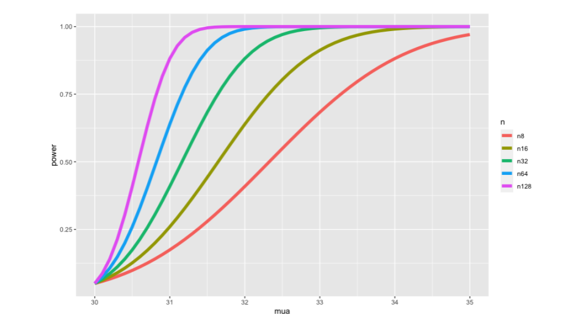
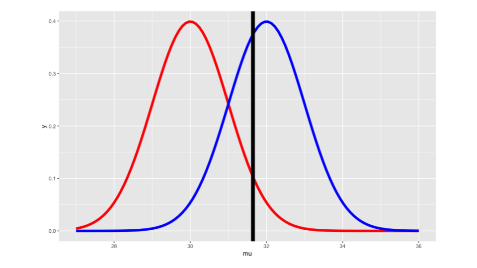
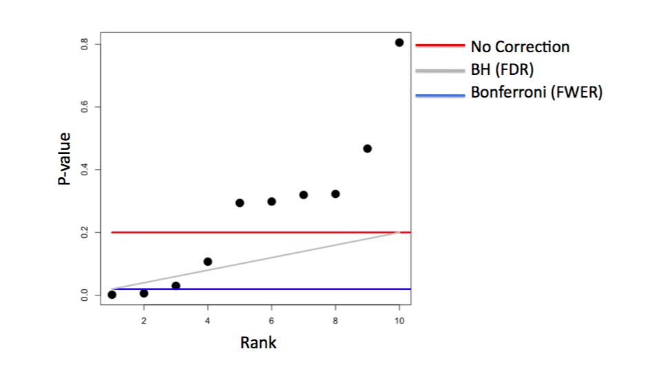
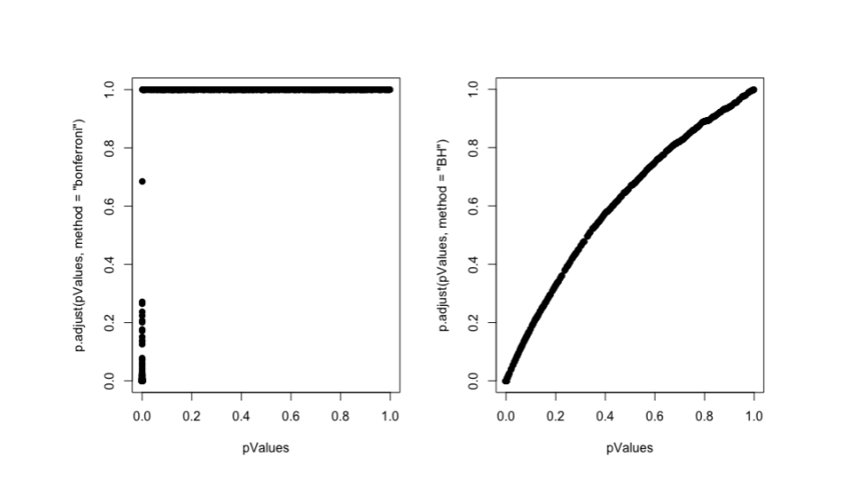
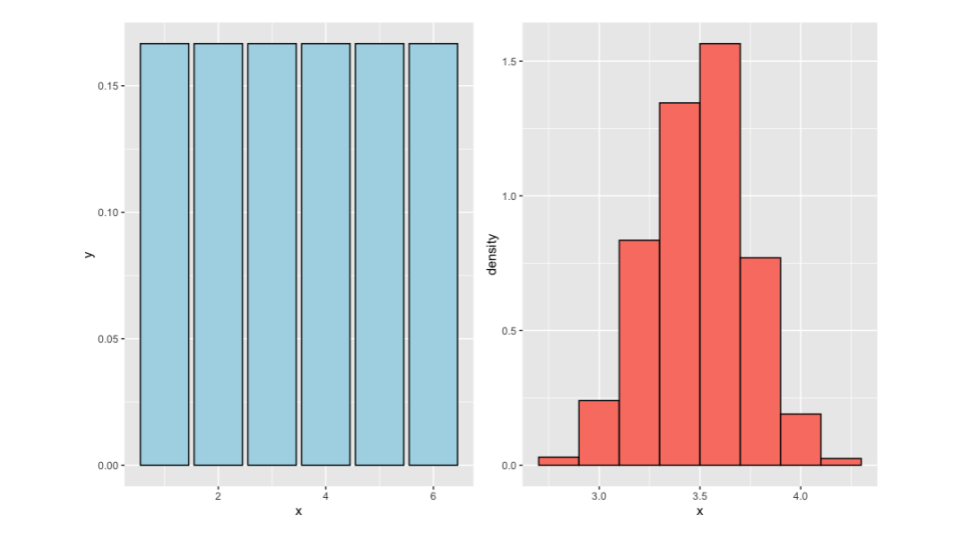
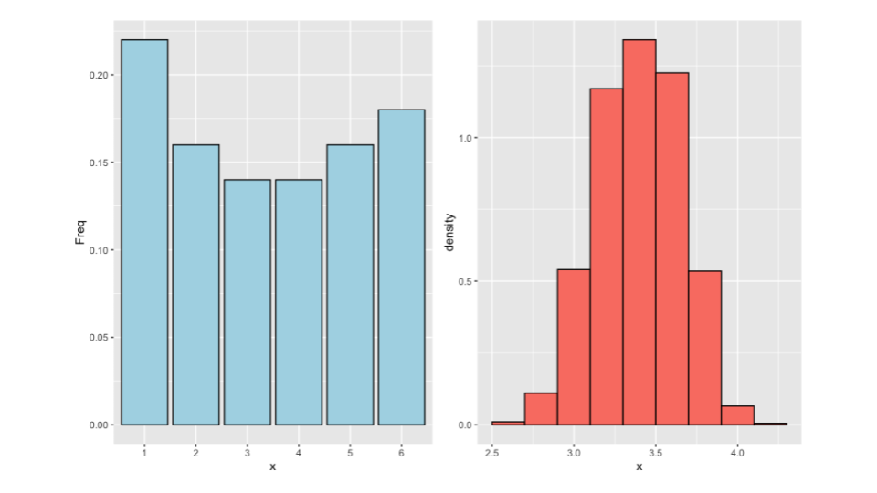
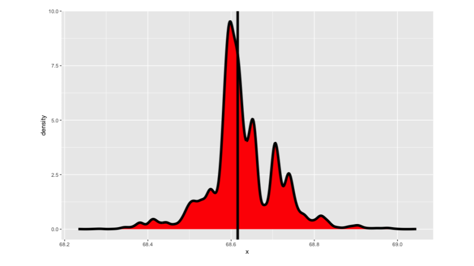
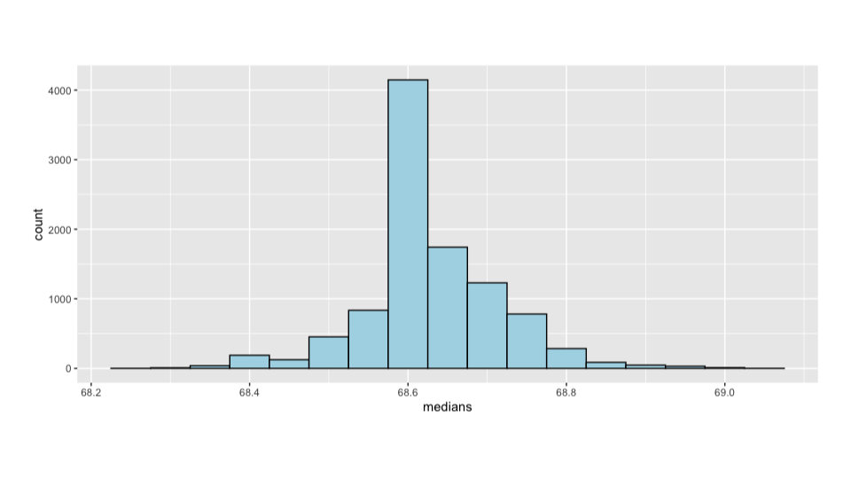
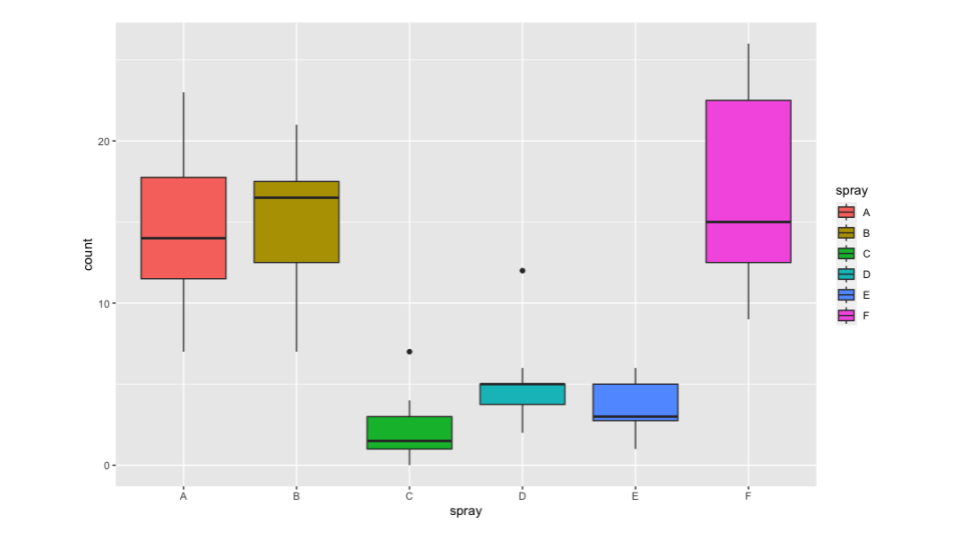
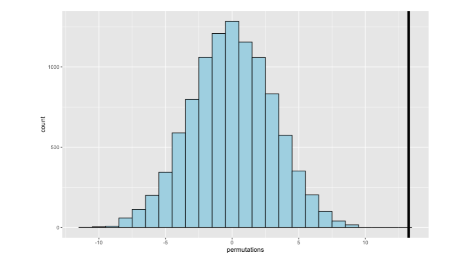

# Power, Bootstrapping, & Permutation Tests
We've talked about a Type I error, rejecting the null hypothesis when it's true.  We've structured our hypothesis test so that the probability of this happening is small. The other kind of error we could make is to fail to reject when the alternative is true (**Type II error**). Or we might think about the probability of rejecting the null when it is false. This is called __Power = 1 - Type II error__. We don't have as much control over this probability, since we've spent all of our flexibility guaranteeing that the Type I error rate is small. One avenue for the control of power is at the design phase. There, assuming our finances let us, we can pick a large enough sample size so that we'd be likely to reject if the alternative is true. Thus the most frequent use of power is to help us design studies.

## Power

Power refers to the probability of rejecting the null hypothesis when it is actually false. As the name suggests, having more power is desirable. Interestingly, power becomes more significant when we fail to reject the null hypothesis than when we do reject it! This is because when we reject the null hypothesis, we are confident that the alternative hypothesis is true. However, when we fail to reject the null hypothesis, we are unsure whether the null hypothesis is true or if we simply failed to detect the alternative hypothesis. Therefore, power is more relevant when we fail to reject the null hypothesis.

Imagine conducting a study to compare Treatment A and Treatment B, where you only randomized three individuals to each treatment. In this case, if you find no significant difference between the two treatments, it wouldn't be surprising because the small sample size limits your power to detect meaningful differences. The null result is somewhat expected due to the limited data. On the other hand, if you had 300 individuals in each treatment group and still failed to reject the null hypothesis, it would be more meaningful because with such a large sample size, you would expect to observe a difference if it truly existed. Therefore, power comes into play more prominently with null results rather than non-null results. Power is commonly considered during the study design phase. You want to design your study in a way that provides a reasonable chance of detecting the alternative hypothesis if it is true. This involves carefully selecting factors like sample size, statistical tests, and effect sizes.

A type II error, also known as a __beta error__, is the failure to reject a false null hypothesis. It is undesirable because it means missing a true effect or relationship. Power is simply $1- \beta$, representing the probability of correctly rejecting the null hypothesis. In hypothesis testing, the two crucial quantities are the type I error rate ($\alpha$) and the type II error rate ($\beta$). However, we often discuss power ($1 - \beta$) rather than $\beta$ itself.

Suppose we are interested in testing the mean respiratory disturbance index (RDI) in a specific population of obese subjects. We want to compare whether the mean RDI ($\mu \geq 30$) . We calculate a t-statistic, which follows a t-distribution under the null hypothesis assumption. By calculating the probability of obtaining a t-statistic larger than the upper quantile of the t-distribution at the significance level $\alpha$, we determine the probability of rejecting the null hypothesis under the assumption that $\mu=30$. This probability corresponds to $\alpha$.

Power, on the other hand, is calculated similarly but with the alternative hypothesis in mind. Instead of plugging in $\mu=30$, we use a value greater than 30. Power represents the probability of correctly rejecting the null hypothesis when the true mean ($\mu > 30$). If we consider a larger $\mu$, such as 60, our power will increase because we'll have a higher chance of detecting the difference. Conversely, if the true alternative mean is very close to the null value, say 30.00001, our power will be lower since it is more challenging to detect such a small difference. Thus, power is a function that depends on the mean under the null hypothesis. Values close to the null mean will resemble the type I error rate, while values far from it will yield higher power, potentially approaching 100%.

### Calculating Power

Assume a sample with normal distribution. This assumption is true either because we have a large sample size and can apply the central limit theorem, or we can simply assume that the underlying population is normally distributed. For the sake of argument, let's assume that the sample mean ($\bar X$) is normally distributed, and the population standard deviation ($\sigma$) is known. In this scenario, we would reject the null hypothesis if our Z-statistic: $\frac{\bar X - 30}{\sigma/\sqrt{n}}>Z_{1-\alpha}$

Alternatively, we can state that we will reject the null hypothesis if $\bar X$ is greater than 30 plus the product of the z quantile and the standard error of the mean.
$$\bar X > 30 + Z_{1-\alpha}\frac{\sigma}{\sqrt{n}}$$

$$Under\space H_0: \bar X \sim N(\mu_0, \sigma^2 / n)$$
$$Under\space H_a: \bar X \sim N(\mu_a, \sigma^2 / n)$$

We can easily calculate the power using the R programming language. By taking the `pnorm` (normal probability)

```r
alpha = 0.05
z = qnorm(1 - alpha)
pnorm(mu0 + z * sigma / sqrt(n), mean = mua, sd = sigma / sqrt(n), lower.tail = FALSE)
```


Example: Suppose someone wants to conduct a study to test whether the mean ($\mu$) for a specific population is 30 or greater. They are interested in detecting a difference as large as 32, with a sample size of 16, and a known standard deviation of 4.

We can plug in these values and calculate the power. When we set $\mu = \mu_0 =30$, the power is 5%. However, when we set $\mu = \mu_a=32$, the power increases to 64%.


```r
mu0 = 30; mua = 32; sigma = 4; n = 16
z = qnorm(1 - alpha)
pnorm(mu0 + z * sigma / sqrt(n), mean = mu0, sd = sigma / sqrt(n), 
      lower.tail = FALSE)
pnorm(mu0 + z * sigma / sqrt(n), mean = mua, sd = sigma / sqrt(n), 
      lower.tail = FALSE)
```

This means there is a 64% probability of detecting a mean as large as 32 or larger if we conduct the experiment. By plotting the power curves, which represent the power as a function of $\mu_a$, with different sample sizes shown in different colors, we can observe interesting patterns.

<div class="figure" style="text-align: center">

<p class="caption">(\#fig:unnamed-chunk-3)Plotting the power curve</p>
</div>


```r
library(ggplot2)
nseq = c(8, 16, 32, 64, 128)
mua = seq(30, 35, by = 0.1)
power = sapply(nseq, function(n)
    pnorm(mu0 + z * sigma / sqrt(n), mean = mua, sd = sigma / sqrt(n), 
          lower.tail = FALSE)
    )
colnames(power) <- paste("n", nseq, sep = "")
d <- data.frame(mua, power)
library(reshape2)
d2 <- melt(d, id.vars = "mua")
names(d2) <- c("mua", "n", "power")    
g <- ggplot(d2, 
            aes(x = mua, y = power, col = n)) + geom_line(size = 2)
g  
```

As $\mu_a$ gets larger, the power increases, which indicates a higher likelihood of detecting a larger difference. Additionally, as the sample size increases, the curves shift upwards and reach higher power levels earlier. This aligns with our expectation that collecting more data increases the likelihood of detecting a specific effect. We can use RStudio's manipulate function to explore power in relation to the two normal distributions. We can visually evaluate the power and observe how it changes with different values.

<div class="figure" style="text-align: center">

<p class="caption">(\#fig:unnamed-chunk-5)Plotting the power curve</p>
</div>


```r
library(manipulate)
mu0 = 30
myplot <- function(sigma, mua, n, alpha){
    g = ggplot(data.frame(mu = c(27, 36)), aes(x = mu))
    g = g + stat_function(fun=dnorm, geom = "line", 
                          args = list(mean = mu0, sd = sigma / sqrt(n)), 
                          size = 2, col = "red")
    g = g + stat_function(fun=dnorm, geom = "line", 
                          args = list(mean = mua, sd = sigma / sqrt(n)), 
                          size = 2, col = "blue")
    xitc = mu0 + qnorm(1 - alpha) * sigma / sqrt(n)
    g = g + geom_vline(xintercept=xitc, size = 3)
    g
}
manipulate(
    myplot(sigma, mua, n, alpha),
    sigma = slider(1, 10, step = 1, initial = 4),
    mua = slider(30, 35, step = 1, initial = 32),
    n = slider(1, 50, step = 1, initial = 16),
    alpha = slider(0.01, 0.1, step = 0.01, initial = 0.05)
    )
```

In this graph the parameters are currently set to the values used in the previous calculations: $\sigma = 4$, $\mu_a = 32$, $n = 16$, and $\alpha = 5%$. The first plot illustrates the distribution of the sample mean under the null hypothesis. It is centered at 30 with a variance of $\sigma^2/n$. The second plot represents the alternative hypothesis, where the sample mean is centered at 32 with the same variance. We have set a critical value (shown as a black line) such that if the sample mean exceeds this threshold, we reject the null hypothesis. The black line is calibrated so that the probability of obtaining statistics larger than it is 5% if the red density is true (i.e., the null hypothesis is true). Power refers to the probability of obtaining a sample mean greater than the black line, assuming the blue curve (alternative hypothesis) is true. In other words, power represents the probability of rejecting the null hypothesis correctly. Conversely, $1-power$ corresponds to the type II error rate. 

If we decrease the significance level ($\alpha$), the black line moves to the right, making it harder to reject the null hypothesis and resulting in lower power. On the other hand, increasing $\alpha$ leads to better power but also increases the type I error rate. When we decrease $\sigma$ (the standard deviation), the black line moves downward. With less variability in the sample mean, the probability of rejecting the null hypothesis (power) approaches 100%. Conversely, increasing $\sigma$ decreases power because there is more noise in the measurements. Adjusting the mean under the alternative hypothesis ($\mu_a$) shifts the black line accordingly. As $\mu_a$ moves closer to 30, power decreases, and as it moves further away, power increases. Manipulating the sample size (n) affects the variance of the sample mean. A larger sample size tightens the densities, resulting in better power. Conversely, a smaller sample size leads to lower power. It is recommended to review the code for the manipulate function to gain a better understanding of power in this context. By experimenting with the various parameters, you can observe how power changes in different ways.

To recap the scenario when testing the alternative hypothesis, specifically focusing on the case where $\mu$ is greater than $\mu_0$ the power is in terms of $1 - \beta$ (where $\beta$ represents the type II error rate), we can use the equation: 
$$1 - \beta = P\left(\bar X > \mu_0 + z_{1-\alpha} \frac{\sigma}{\sqrt{n}} ; \mu = \mu_a \right)$$

Here, $P$ is the probability that the sample mean $\bar X$ is larger than $\mu_0$, calculated under the assumption that $\mu$ equals $\mu_a$ (the mean under the alternative hypothesis). It's important to note that $\bar X$ follows a normal distribution with mean $\mu_a$ and variance $\sigma^2/n$. The key point to highlight is that in this equation, $\mu_a$, $\sigma$, $n$, and $\beta$ are the unknowns, while $\mu_0$ and usually $\alpha$ (the specified type I error rate) are known. By specifying any three of the unknowns, you can solve for the fourth. For example, if you know the desired alternative mean ($\mu_a$), the assumed standard deviation ($\sigma$), and the desired sample size (n), you can solve for power. This approach is commonly used in power calculations during trial planning. Usually, the main concerns revolve around n (sample size) or $\beta$ (desired power). You may want to determine the necessary sample size to achieve a specific power level, or given a fixed sample size, assess the resulting power. However, you can also solve for $\mu_a$ or $\sigma$ depending on your requirements.

Here are some basic rules regarding power:

1. As alpha (significance level) increases, power also increases. The power of a one-sided test is greater than the power of the corresponding two-sided test.
2. The further $\mu_a$ (mean under the alternative hypothesis) is from $\mu_0$, the higher the power.
3. As the sample size (n) increases, the sample mean has less variability, resulting in higher power.
4. When the standard deviation ($\sigma$) decreases, the sample mean has less variability, leading to higher power.

An interesting fact about power is that it often depends on a function of these parameters rather than each parameter individually. In this case, the function is one-dimensional, so you only need to know one number to calculate power. That number is the effect size, which is the difference between the null and alternative means divided by the standard error. The effect size is unit-free, making it useful and interpretable across different problems.
### T test power
We do not actually calculate power in the exact manner described in the previous section. Those were meant to help understand the concepts, assuming we knew $\sigma$ and the data followed a Gaussian distribution or could be approximated as such due to the central limit theorem. We often use the `power.t.test` function in R to calculate power. We will provide some insights around t-test power before explaining how to use `power.t.test`.

The argument for t-test power is similar to what we did for the normal distribution case. We reject the null hypothesis if our test statistic, $\frac{\bar X - \mu_0}{S\sqrt{n}}$, exceeds $t_{1-\alpha,n-1}$ a quantile instead of a z quantile since we are dealing with a t-test.
However, when calculating power, this is done under the assumption that $\mu=\mu_a$ (the value under the alternative hypothesis), not $\mu_0$. It is important to note that the statistic ($\frac{\bar X - \mu_0}{S\sqrt{n}}$) does not follow a t-distribution if the true mean is not $\mu_0$. Instead, it follows something called the non-central t-distribution, which we won't cover here. Thus, evaluating the non-central t-distribution is necessary to calculate power.

The `power.t.test` function allows you to calculate power by evaluating the non-central t-distribution. Similar to before, you have some known parameters like $\mu_0$ and $\alpha$, and some unknown parameters like $\mu_a$, $\sigma$, and $n$. By omitting one of the unknown parameters and specifying the others, `power.t.test` will solve for the omitted parameter.

In the following examples, we specify n, `delta` (difference in means), and the standard deviation to calculate power.


```r
power.t.test(n = 16, delta = 2 / 4, sd=1, type = "one.sample",  alt = "one.sided")$power
power.t.test(n = 16, delta = 2, sd=4, type = "one.sample",  alt = "one.sided")$power
power.t.test(n = 16, delta = 100, sd=200, type = "one.sample", alt = "one.sided")$power
```

The resulting power is dependent on the effect size, which is the difference between $\mu_0$ and $\mu_a$ divided by the standard deviation. The effect size is the key factor driving the power calculation.

We can also calculate sample size by providing the desired power to `power.t.test`. 


```r
power.t.test(power = .8, delta = 2 / 4, sd=1, type = "one.sample",  alt = "one.sided")$n
power.t.test(power = .8, delta = 2, sd=4, type = "one.sample",  alt = "one.sided")$n
power.t.test(power = .8, delta = 100, sd=200, type = "one.sample", alt = "one.sided")$n
```

For a given effect size, we can determine the required sample size to achieve a specific power level. It is advisable to round up the fractional sample size to the nearest integer when dealing with real data.

Throughout the examples, we observe that the calculations remain the same when specifying equivalent effect sizes, regardless of the specific values used for `delta` and the standard deviation.

Exercise: you can omit the delta parameter and input a specific sample size (n) into the `power.t.test` function. This will allow you to determine the minimum detectable delta, the smallest difference between mu0 and mu a that can be detected with 80% power using that sample size. With the code provided earlier, this extension should not be too challenging.

We recommend using `power.t.test` as your initial approach for power calculations. One of the main reasons behind this preference is that power calculations involve various factors and settings that can easily lead to confusion. It is common to overestimate the power or underestimate the required sample size. Therefore, when in doubt, it is advisable to simplify the power calculation as much as possible. You can try to reframe your question as a t-test or a binomial test to perform a straightforward power calculation. Although this approach may yield a slightly conservative power or sample size estimate, it provides a clear understanding of the calculation. Once you have a solid foundation, you can proceed to more complex power calculations if necessary.

## Multiple Comparisons
This topic is being taught by Jeff Leek. Jeff is known for his contributions to the field.

This part focuses on the topic of multiple testing. We discussed hypothesis testing earlier in the course, and mentioned the importance of correcting for multiple tests to avoid deceiving ourselves. In this section, we'll explore how to perform these corrections. The underlying idea is that hypothesis testing and significance analysis are frequently used techniques. However, they are often misused. One common practice is calculating multiple p-values when analyzing the same dataset and then only reporting the smallest p-value or considering all p-values below 0.05 as significant. This approach leads to issues as we demonstrate shortly.

Our goal is to correct for multiple testing in order to prevent false positives or false discoveries when conducting analyses involving numerous variables. There are two essential components to multiple testing corrections. First, we need to define an error measure that we want to control. Second, we require a statistical method or correction that helps control that error measure. These concepts are related to the three eras of statistics, as discussed in Brad Efron's book. The first era focused on large-scale population description using extensive datasets. The second era developed optimal inference techniques for extracting information from small sample sizes when data collection was challenging and costly. The third and current era is characterized by scientific mass production, where data is readily available and inexpensive. However, this also means that we perform an increasing number of analyses. If we fail to correct for the fact that each analysis carries a small potential for error, these errors can accumulate.

The need for multiple testing corrections arises due to advancements in technology, which have led to a proliferation of data. These technologies span various fields, from next-generation sequencing in molecular biology to patient imaging in clinical studies and the use of electronic medical records. Additionally, personalized or individualized quantitative self-measurements, such as those obtained with devices like the Nike Fuel Band or FitBit, contribute to the increase in available data. So, why should we correct for multiple tests? Allow me to illustrate the key problem using this cartoon example from [xkcd page](https://xkcd.com/882/), where we want to investigate whether jelly beans cause acne..


So what happens is you send a team of scientists to investigate the relationship between jelly beans and acne. Initially, they examine all types of jelly beans and find that the p-value is greater than 0.05, indicating no significant association. They then decide to test each color of jelly beans individually to see if any specific color is linked to acne. However, for each color tested, the p-value is still greater than 0.05, so they do not report any significant results. Finally, after testing over 20 different types of jelly beans, they discover a significant association between green jelly beans and acne. They claim that there is only a 5% chance of this association occurring by chance alone. However, considering the number of hypotheses tested (20 in this case), it becomes highly likely that at least one of them would result in a coincidental finding. If we allow for a 5% chance of error in each hypothesis test and perform at least 20 tests, we can expect to encounter at least one error, as 20 multiplied by 5% is approximately 100%. We have been using p-values and hypothesis testing as interchangeable terms, but they are not exactly the same.


To illustrate this, let's consider a hypothesis test for a parameter, $\beta$, where we want to determine if it equals zero or not.
In a linear regression model, if the coefficient for a certain variable is equal to zero, it implies no association between the variables. Conversely, if it is not equal to zero, there is some association. To perform a hypothesis test, we fit the linear regression model and calculate a p-value. Then, we compare the p-value to a predetermined threshold. If the p-value is below the threshold, we reject the null hypothesis that $\beta$ equals zero and conclude that $\beta$ is not equal to zero. If the p-value is above the threshold, we fail to reject the null hypothesis and state that $\beta$ equals zero. This is the essence of a hypothesis test.

In the context of hypothesis testing, we have a table of possible outcomes. Each row represents a specific claim about $\beta$ (equal to zero or not equal to zero), while each column represents the true state of the world ($\beta$ equals zero or not equal to zero). When conducting multiple hypothesis tests, situations where we claim $\beta$ is equal to zero but it is actually not fall into one cell, and situations where we claim $\beta$ is not equal to zero but it is actually equal to zero fall into another cell. Therefore, there are two types of errors that can occur.

|| $\beta=0$| $\beta\neq0$|$Hypotheses$|
---|---|---|---|
Claim $\beta=0$|$U$|$T$|$m-R$|
Claim $\beta\neq 0$ |$V$|$S$|$R$|
Claims|$m_0$|$m-m_0$|$m$|

Type I errors, or false positives, occur when we claim that beta is not equal to zero (there is a relationship), but in reality, there is no relationship. We denote the number of these errors as v. On the other hand, Type II errors, or false negatives, occur when we claim that beta is equal to zero (no relationship), but in reality, there is a relationship.

Generally, when conducting scientific investigations, people tend to be more concerned about Type I errors, or false positives. We want to minimize the number of times we are led astray or encounter false positives. However, the emphasis on the two error rates may vary depending on the nature of the problem and the relative costs associated with each type of error. In multiple testing, there are several error rates to consider, which form the first component of a multiple testing procedure.

The first error rate to consider is the false positive rate. This rate represents the frequency at which false results are deemed significant. In other words, it measures the average fraction of times we classify results as significant when they are not. This rate is calculated by dividing the number of false significant variables by the total number of non-significant variables.

Another error measure is the family-wise error rate (FWER). It quantifies the probability of having at least one false positive result. The variable V represents the count of instances where there is no relationship between variables, yet we claim that there is. By controlling the family-wise error rate, we aim to limit the probability of making one or more false claims.

The false discovery rate (FDR) is a distinct error measure that differs from the false positive rate. It captures the rate at which claims of significance are false. It calculates the ratio of expected false discoveries (E) to the number of claims of significance (R). In other words, it measures the rate at which our assertions of a relationship between variables are incorrect.

The false positive rate is closely related to the Type I error rate, but there is a subtle distinction between the two. If you want to explore this topic further, you can refer to the Wikipedia page [linked here](https://en.wikipedia.org/wiki/False_positive_rate).

The next step in multiple testing is defining a procedure that can control the specified error measure. In other words, we need a method to constrain the error rate in a particular manner. To control the false positive rate, you can utilize the calculated p-values directly. By setting a threshold alpha (between 0 and 1) and considering all p-values below this threshold as significant, you can effectively control the false positive rate at the chosen level on average.

In other words, when controlling the false positive rate, the expected rate of false positives is kept below the threshold alpha. However, there's a problem with this approach. Let's consider a scenario where you perform a large number of hypothesis tests, say 10,000 tests. Although this might seem extreme, it is common in high-dimensional settings or signal processing contexts. If you designate all p-values below 0.05 as significant (with alpha set to 0.05), the expected number of false positives would be 500 (10,000 tests multiplied by the false positive rate). Consequently, if you obtain 500 significant results from these tests, it is highly likely that most of them are false positives. This raises the question of how to control a different error rate to avoid an excessive number of false positives.

One option is to control the family-wise error rate, as discussed earlier. The [Bonferroni correction](https://en.wikipedia.org/wiki/Bonferroni_correction), the oldest multiple testing correction method, can be used for this purpose. The basic idea is to calculate the p-values normally and then adjust the $\alpha$ level. By dividing the original $\alpha$ by the number of hypothesis tests performed (e.g., $\alpha$ divided by 10 if there are 10 tests), a new $\alpha$ level is obtained. Any p-values below this new $\alpha$ level are deemed significant, effectively controlling the family-wise error rate on average. This method is easy to calculate and minimizes errors, as the probability of even one false positive is kept low. However, a downside is that it can be overly conservative, especially when dealing with a large number of tests. Allowing for a few false positives might be preferred if it increases the chances of discovering more genuine signals.

__Basic idea__: 
* Suppose you do $m$ tests
* You want to control FWER at level $\alpha$ so $Pr(V \geq 1) < \alpha$
* Calculate P-values normally
* Set $\alpha_{fwer} = \alpha/m$
* Call all $P$-values less than $\alpha_{fwer}$ significant

__Pros__: Easy to calculate, conservative
__Cons__: May be very conservative

This is where the false discovery rate (FDR) correction comes into play. It is the most commonly used error rate correction method for multiple testing, particularly when conducting numerous hypothesis tests in genomics, imaging, astronomy, and other signal processing fields. The FDR aims to control the expected number of false discoveries divided by the total number of discoveries, which can be interpreted as the level of noise in the results. If the FDR is set to $\alpha$, it means that you expect $\alpha$ percent of the claimed discoveries to be false. To apply the FDR correction, calculate the p-values normally and arrange them in ascending order. Each p-value is annotated with its rank (e.g., the smallest p-value is labeled as (1)).

__Basic idea__: 
* Suppose you do $m$ tests
* You want to control FDR at level $\alpha$ so $E\left[\frac{V}{R}\right]$
* Calculate P-values normally
* Order the P-values from smallest to largest $P_{(1)},...,P_{(m)}$
* Call any $P_{(i)} \leq \alpha \times \frac{i}{m}$ significant

__Pros__: Still pretty easy to calculate, less conservative (maybe much less)

__Cons__: Allows for more false positives, may behave strangely under dependence

Now we consider the smallest calculated p-value, denoted as (1), and order them up to the maximum p-value, denoted as (m). Let's assume there are m hypothesis tests. For each p-value at the ith position, we check if it is less than or equal to alpha times i divided by m. If this condition is true, we deem it significant; otherwise, we do not. This procedure is designed to control the false discovery rate. It shares similarities with the Bonferroni correction in terms of ease of calculation, but it is less conservative. If there is a substantial amount of signal present and a few false positives can be tolerated, the false discovery rate correction may lead to the discovery of more genuine signals. However, it does allow for more false positives, especially if the error rate is set to a large value. Additionally, it may exhibit peculiar behavior when there is dependence among the hypothesis tests.

Example: In the following graph we will control all the error rates we discussed at a level of 0.2. Here, we have ten p-values ordered from smallest to largest. On the y-axis, we have the p-values themselves. The red line represents all the p-values that would be considered significant at an uncorrected alpha level of 0.2. It corresponds to the p-values below 0.2. Although this no-correction approach controls the false positive rate, it can lead to a significant number of false positives when conducting numerous hypothesis tests.

<div class="figure" style="text-align: center">

<p class="caption">(\#fig:unnamed-chunk-9)Plotting the power curve</p>
</div>

Next, let's examine the false discovery rate. This correction aims to control the proportion of false positives at a level of 0.2. To calculate this, we follow the gray line, which is a linear line with a slope determined by the alpha level. We compare each p-value with this line from smallest to largest. In this example, we would call the first three p-values significant, thus controlling a slightly different error measure. Lastly, the Bonferroni correction involves dividing 0.2 by the number of hypothesis tests (in this case, 10) to obtain 0.02. This corresponds to a horizontal line. According to the Bonferroni correction, only the first two p-values would be considered significant, and the remaining ones would be deemed insignificant. The Bonferroni correction imposes a more stringent control over the family-wise error rate. This example provides a conceptual understanding of how different procedures work and where the cutoffs are set for different sets of p-values.

Another approach is to adjust the p-values instead of adjusting the alpha level. Adjusted p-values, also known as corrected p-values, can be calculated to directly control error measures without modifying the alpha parameter. It is worth noting that adjusted p-values do not possess the same properties as classical p-values and should not be treated as such. However, they can be useful for controlling error measures.

Example: Using the Bonferroni correction show how adjusted p-values work. Suppose we have m p-values. To adjust them, we can calculate m times each p-value and take the maximum of that and 1. This ensures that the adjusted p-values do not exceed 1, just like the original p-values. By multiplying the p-values by m instead of dividing alpha by m, we can determine the number of adjusted p-values that are less than alpha. This yields the same set of significant results as before. Consequently, we can use these adjusted p-values, such as Bonferroni-adjusted p-values, to assess significance by comparing them to the original alpha level, such as 0.05. If we multiply the p-values by the number of tests performed and count how many are less than alpha, we effectively control the family-wise error rate at level alpha.

Now, let's consider an example where there are no true positives. 


```r
set.seed(1010093)
pValues <- rep(NA,1000)
for(i in 1:1000){
  y <- rnorm(20)
  x <- rnorm(20)
  pValues[i] <- summary(lm(y ~ x))$coeff[2,4]
}

# Controls false positive rate
sum(pValues < 0.05)
```

In this simulation, 1,000 data sets are generated where the variables y and x have no relationship. Despite this absence of a relationship, the p-values for the relationship between y and x are calculated for all 1,000 simulated examples. Among these p-values, the number that is less than 0.05 is determined. In this case, even though there is no true relationship, approximately 5% of the performed tests are falsely identified as significant, amounting to 51 tests.
To address this, we can adjust the p-values and apply corrections like the Bonferroni correction or the Benjamini-Hochberg correction for controlling the false discovery rate. Using the `P.adjust` function in R, the p-values are adjusted accordingly.


```r
# Controls FWER 
sum(p.adjust(pValues,method="bonferroni") < 0.05)
# Controls FDR 
sum(p.adjust(pValues,method="BH") < 0.05)
```

For the Bonferroni correction, the adjusted p-values are compared to the alpha level of 0.05, resulting in zero significant discoveries when there are no true positives. Similarly, the Benjamini-Hochberg correction can be applied by adjusting the p-values and examining the number of adjusted p-values less than 0.05. Again, in the case of no significant relationships, no discoveries should be made, and the result reflects this expectation.

Now, let's consider another simulated scenario to further illustrate the concepts. In this case, we will have a relationship between the two variables 50% of the time. 


```r
set.seed(1010093)
pValues <- rep(NA,1000)
for(i in 1:1000){
  x <- rnorm(20)
  # First 500 beta=0, last 500 beta=2
  if(i <= 500){y <- rnorm(20)}else{ y <- rnorm(20,mean=2*x)}
  pValues[i] <- summary(lm(y ~ x))$coeff[2,4]
}
trueStatus <- rep(c("zero","not zero"),each=500)
table(pValues < 0.05, trueStatus)
```

To simulate this, we generate 1,000 sets of y and x variables. For the first 500 sets, the y values are independent of x, while for the last 500 sets, the y values have a mean equal to 2 times x, indicating a relationship between y and x. We calculate a p-value for each case and define the true status as beta = 0 for the first 500 sets and beta ≠ 0 for the last 500 sets. This allows us to analyze the results.

First, let's examine the number of p-values less than 0.05 without any correction. We find that, in cases where there is actually no relationship between the variables, we still have around 5% false positive results. On the other hand, for the cases where there is a relationship, all the p-values are less than 0.05, correctly identifying the true signals.


```r
# Controls FWER 
table(p.adjust(pValues,method="bonferroni") < 0.05,trueStatus)
# Controls FDR 
table(p.adjust(pValues,method="BH") < 0.05,trueStatus)
```

Next, if we apply the Bonferroni correction by adjusting the p-values using the P.adjust function with the method set to Bonferroni, we observe slightly fewer significant results. In other words, we miss 23 cases where there should be a signal. However, we have zero false positives because we are controlling the probability of any false positive to be less than 0.05.

Now, let's consider the false discovery rate (FDR) and apply the Benjamini-Hochberg correction. By setting the method to "bh" in the P.adjust function, we discover all the significant results, but we identify fewer false positives compared to the uncorrected analysis. In this case, around 5% of the cases are falsely called significant, while only about 5% of the time is there actually no true relationship.

To visualize the effects of the p-value adjustment, we can plot the p-values versus the adjusted p-values for both the Bonferroni correction and the Benjamini-Hochberg correction. For the Bonferroni method, we multiply each p-value by the number of tests performed (1,000 in this case). As a result, the smallest p-values remain less than one, but beyond a certain point, all the p-values multiplied by 1,000 become equal to or greater than one. Since adjusted p-values cannot exceed one, we observe a flat line in the plot.

<div class="figure" style="text-align: center">

<p class="caption">(\#fig:unnamed-chunk-14)Plotting the p_values</p>
</div>


```r
par(mfrow=c(1,2))
plot(pValues,p.adjust(pValues,method="bonferroni"),pch=19)
plot(pValues,p.adjust(pValues,method="BH"),pch=19)
```

Overall, these analyses demonstrate the usefulness of p-value adjustment methods in understanding and controlling error rates, even though they may not directly impact the performance of hypothesis tests.

In contrast, when applying the Benjamini-Hochberg correction, we observe a slightly increasing function between the p-value and the adjusted p-value. The adjusted p-value is generally larger across the entire range compared to the actual p-value, although not significantly larger in this particular case. This behavior occurs because there are many significant results present.

Now, let's discuss some additional notes and resources related to multiple testing. Multiple testing is a subfield of statistics with various correction methods available depending on factors such as the dependence structure and specific choices made in the statistical model.

For most standard problems, the basic Bonferroni or Benjamini-Hochberg correction is usually sufficient. However, if there is strong dependence between the tests, you may want to consider using the "method = BY" option in the p.adjust function or explore other direct adjustments tailored to the dependence between hypothesis tests. We have conducted some research in this area, and I invite you to explore my papers for more information.

Regarding resources, there is a comprehensive and informative paper titled "A Gentle Introduction to Multiple Testing Procedures with Applications in Genomics." It focuses on genomics, an area where multiple testing has seen significant development as a statistical discipline. Similarly, "Statistical Significance for Genome-Wide Studies" provides a gentle introduction to multiple testing, even for readers not familiar with molecular biology.

* [Multiple testing procedures with applications to genomics](http://www.amazon.com/Multiple-Procedures-Applications-Genomics-Statistics/dp/0387493166/ref=sr_1_2/102-3292576-129059?ie=UTF8&s=books&qid=1187394873&sr=1-2)
* [Statistical significance for genome-wide studies](http://www.pnas.org/content/100/16/9440.full)
* [Introduction to multiple testing](http://ies.ed.gov/ncee/pubs/20084018/app_b.asp)

Lastly, if you're interested in delving deeper into multiple testing, We recommend a comprehensive introduction that covers the basics in more depth. It serves as a valuable resource for expanding your understanding of this topic.
## Resampling
Resampling-based procedures offer a means to perform statistical inferences based on the data at hand, without relying heavily on population parameters. Data scientists tend to favor resampling-based inferences due to their data-centric nature, scalability to large studies, and minimal reliance on assumptions. These procedures allow us to make robust inferences by leveraging the available data and are particularly valuable when dealing with complex or uncertain scenarios.
### Bootstrapping
The bootstrap method, invented by the renowned statistician Bradley Efron in 1979, is an incredibly valuable tool for constructing confidence intervals, estimating standard errors, and performing inferences that would otherwise be challenging. In fact, it is considered one of the most important procedures in the history of statistics, as it has liberated data analysts from relying heavily on complex mathematical calculations to obtain distributional properties of statistics.

The term "bootstrap" originates from the phrase "pulling oneself up by one's bootstraps." The concept of the bootstrap procedure is not about achieving the physically impossible, but rather about leveraging available information to make reliable inferences. It enables us to directly connect the information we have with the inferences we make, making it a fitting name for this statistical technique. The bootstrap method is both important and liberating, aligning well with the spirit of data science.
Example: Imagine we want to evaluate the behavior of the average of 50 die rolls. The population distribution is depicted by the equally weighted bars representing the numbers one through six.

<div class="figure" style="text-align: center">

<p class="caption">(\#fig:unnamed-chunk-16)Die roll</p>
</div>

There are a couple of approaches we could take. One option is to mathematically derive the distribution of the average of 50 die rolls without resorting to simulation. Another approach is to roll the die 50 times, calculate the average, and repeat this process numerous times to obtain multiple averages. However, this method assumes that the true population distribution is one-sixth for each number. While it may be challenging to determine the probability of obtaining a value like 5.5 through calculations alone, rolling the die multiple times and averaging the results provides a practical and intuitive way to estimate it. For certain statistics like the average, we have some knowledge about their distribution, such as the centering around the population mean and the variance being equal to sigma squared divided by n. However, we will focus on the average initially to demonstrate how the bootstrap method extends to other statistics beyond the average.

Consider a similar problem where we are uncertain about the fairness of the die generating our data. We don't know the probabilities assigned to each number (one, two, three, four, five, or six). We only have a single sample of size 50, so we don't have a distribution of averages from the true die that generated the data. On the left-hand side, you can see a histogram representing the occurrences of each number based on one sample realization from this unknown population.

<div class="figure" style="text-align: center">

<p class="caption">(\#fig:unnamed-chunk-17)Die roll</p>
</div>

In this scenario, we cannot evaluate the behavior of averages of 50 die rolls from this population since we don't know the population distribution or which die to roll from. Here's where bootstrapping comes into play. Instead of sampling from the true distribution, we can sample repeatedly from our empirical distribution. We create collections of 50 die rolls using the probabilities estimated from our sample. In this case, we would sample from the blue bars, considering their respective probabilities, and repeat this process to obtain averages from these samples. By doing so, we can understand the distribution of averages, even though we only have one true average from the real population. Mechanically, the bootstrap procedure involves taking each observation (one, two, three, four, five, or six) and putting them into a bag. Then, we draw samples of size 50 from this bag with replacement, meaning the same data point might be selected multiple times. We calculate the average for each sample and repeat this process several times. The fundamental idea is to precisely replicate the simulation experiment we would have conducted if we had access to the true population die and used the observed distribution generated by the specific realization of 50 die rolls we obtained.

This is the basic principle of bootstrapping: we utilize our observed data to construct an estimated population distribution. Then, we simulate from this estimated distribution to understand the distribution of a statistic we are interested in. In the upcoming examples, we will explore less contrived scenarios to illustrate the application of bootstrapping.

Now, we will explore the data using the R programming language and specifically the `father.son` dataset. To simplify the process, I will define the variable `x` to represent the sons' heights from the dataset. We'll denote `n` as the number of observations, and for our bootstrapping procedure, we will perform 10,000 bootstrap resamples.


```r
library(UsingR)
data(father.son)
x <- father.son$sheight
n <- length(x)
B <- 10000
resamples <- matrix(sample(x,
                           n * B,
                           replace = TRUE),
                    B, n)
resampledMedians <- apply(resamples, 1, median)
```

First, we will use the `sample` command. When we specify `sample(x, n, replace = TRUE)`, it means that we draw a sample of size `n` from the variable `x` with replacement.

<div class="figure" style="text-align: center">

<p class="caption">(\#fig:unnamed-chunk-19)Plot of the histogram of the resamples</p>
</div>

In other words, each time we select an observation, we put it back into the pool before drawing the next one. This process simulates resampling from an empirical distribution defined by our data, where each observed data point has a probability of 1/n. This is known as the empirical distribution.

Next, we arrange these resamples into a matrix with the number of bootstrap rows and the number of sample size columns. Each row of this matrix, called "resamples," represents a completely resampled dataset. We take the original data and draw a sample of size "n" with replacement to create each resampled dataset. This is equivalent to regenerating a sample of size "n" from a distribution that assigns a probability of 1/n to each observed data point.

Suppose we are interested in a specific statistic, such as the median. For each resampled dataset, we calculate the median using the `apply` statement. The density estimate obtained from the resampled medians is visualized, with a vertical line representing the observed median. In this case, we have repeatedly drawn new datasets of the same length from the collection of sons' heights, applying the median calculation each time. This process is repeated 10,000 times, resulting in a collection of medians. The density estimate provides an approximation of the distribution of medians based on our observed data when we lack knowledge of the actual population distribution. The median serves as a central quantity in bootstrapping.

Using the resampled distribution, we can perform various calculations. For example, we can compute the standard deviation of this distribution to estimate the standard error of the median. Additionally, we can use quantiles to obtain confidence interval estimates. These are the types of analyses commonly performed using bootstrap resampled distributions.

### Notes on the bootstrap
The bootstrap principle states that if you have a statistic that estimates a population parameter of interest, but you don't know the sampling distribution of that statistic, you can use the distribution defined by the observed data to investigate and estimate the sampling distribution. While the bootstrap principle doesn't necessarily require simulation, it is often easier and more practical to use simulation methods. For instance, if you want to determine the distribution of the average of 50 die rolls, it would be challenging to mathematically derive it precisely, making simulation a more feasible approach.

In the context of bootstrapping, we will focus on a few aspects, such as creating confidence intervals and estimating standard errors. The field of bootstrapping offers a wealth of possibilities beyond what we will cover here.

Let's review the general procedure. You start with your observed data and simulate complete datasets by drawing from the observed data with replacement. This process is an approximation of drawing from the sampling distribution of the statistic of interest, as far as the observed data approximates the real population distribution. As a reminder, we calculate the statistic for each simulated dataset and then use these simulated statistics to define a confidence interval or compute the standard deviation of the distribution to estimate the standard error.

Now, let's dive into the bootstrap algorithm for calculating a confidence interval or the bootstrap standard error for the median based on a set of N observations. We begin with a vector of length N representing our data. The next step is to resample N observations with replacement from the observed data to create a resampled complete dataset. It's crucial to sample with replacement to allow for the possibility of repeated observations in the resampled dataset. If we didn't sample with replacement, we would essentially end up with a copy of the original dataset, albeit with a different order. In our example, we calculate the median for each resampled dataset. If you're interested in a different statistic, you would simply compute that statistic for the simulated dataset. We repeat this resampling step B times, where B is the number of bootstrap resamples. It is advisable to choose a large value for B to minimize the Monte Carlo error, which refers to the error introduced by the approximation involved in using resampling. Ideally, we would know the exact bootstrap distribution without resorting to resampling, but in practice, we rely on Monte Carlo methods. Setting B to a sufficiently large value, such as 10,000 or more, ensures that the medians obtained from the resampling process are drawn approximately from the sampling distribution of the median based on N observations.

The bootstrap procedure allows us to approximate the population distribution, which is often sufficient for our purposes. There is substantial theoretical evidence supporting the effectiveness of the bootstrap method. With bootstrap resamples, we can perform various analyses. First, it is common to visualize the distribution using density estimates or histograms. Additionally, we can calculate the standard deviation of the bootstrap resamples, providing an estimate of the standard error of the median. Moreover, by taking quantiles of the bootstrap resampled medians, such as the 2.5th and 97.5th percentiles, we can construct a bootstrap confidence interval for the median. This approach provides a straightforward way to develop a confidence interval without relying on complex statistical techniques.

Now let's go through a quick example code using the father-son data. We have a vector `X` representing the sons' heights, `B` as the number of bootstrap resamples (set to 10,000), and `N` as the length of `X`. To obtain complete resampled datasets, we use the `sample` command in R with `replace = TRUE`, sampling `N * B` elements from `X`. The resulting vector is then reshaped into a matrix with `B` rows and `N` columns, where each row represents a bootstrap resample. Next, we calculate the median for each row, and the standard deviation of these medians provides an estimate of the standard error of the median.


```r
B <- 10000
resamples <- matrix(sample(x,
                           n * B,
                           replace = TRUE),
                    B, n)
medians <- apply(resamples, 1, median)
sd(medians)
quantile(medians, c(.025, .975))
```

For the construction of a confidence interval, we extract the vector of resampled medians and compute the quantiles. In this example, we take the 2.5th and 97.5th percentiles to obtain a 95% confidence interval. The histogram of the bootstrap resamples is plotted using `ggplot`, which takes a data frame as input. The resulting plot provides an estimate of the sampling distribution of the median based on the bootstrap resamples.

<div class="figure" style="text-align: center">

<p class="caption">(\#fig:unnamed-chunk-21)Histogram of bootstrap resamples</p>
</div>

It's worth noting that the bootstrap procedure we discussed here is the non-parametric bootstrap. The confidence interval obtained by taking the percentiles can be improved upon by using the bias-corrected and accelerated (BCa) interval. This interval accounts for bias and is easy to implement using the bootstrap package in R. This introduction provides a basic understanding of the bootstrap method. It is an incredibly useful procedure with numerous variations and wide applicability. When dealing with specific scenarios such as time series, regression models, longitudinal or multilevel data, there are additional considerations and techniques to apply the bootstrap effectively.

### Permutation tests
We'll conclude the class by discussing a highly valuable tool for data scientists known as permutation tests. These tests are particularly useful for group comparisons, so let's start with an example to illustrate their application.

<div class="figure" style="text-align: center">

<p class="caption">(\#fig:unnamed-chunk-22)Insect spray data</p>
</div>

In this study, researchers conducted experiments with batches of insects, applying different pesticides labeled as sprays. The number of dead insects in each batch was recorded for each spray. Let's focus on comparing insect spray B with insect spray C. The null hypothesis states that the distributions of observations from each group are the same, implying that the specific labels of the counts are irrelevant. To operationalize this, we can imagine a data frame with counts in one column and spray group labels in another column. We would calculate a statistic such as the difference in the average number of insects killed between group B and group C. This observed test statistic represents the difference we observe in the data.

Now, let's consider permuting the group labels. We can randomly shuffle the vector of labels using a command like `sample` in R. After permuting, we recalculate the test statistic for each permutation. You can choose any statistic you prefer, such as the mean difference in counts, the geometric means, or even a t-statistic. Rather than comparing the test statistic with a t-null distribution, we compare it to a permutation-based null distribution. To calculate a p-value, we determine the percentage of simulations in which the simulated statistic was more extreme, favoring the alternative hypothesis, compared to the observed statistic. In the case of a difference in means, "more extreme" would mean a greater difference in means in the direction of the alternative hypothesis. This process yields a permutation-based p-value.

Data type | Statistic | Test name 
---|---|---|
Ranks | rank sum | rank sum test
Binary | hypergeometric prob | Fisher's exact test
Raw data | | ordinary permutation test

Permutation tests are powerful and have been reinvented in various settings. For example, the rank sum test, a well-known test statistic, is a permutation test where the data is replaced by ranks instead of the original raw values. Fisher's exact test, which you may have heard of, is another permutation-based test in which the data is binary, and a specific test statistic is employed. If you use the raw data directly, you are essentially conducting an ordinary permutation test. It's worth mentioning that randomization tests exist as a separate entity, specifically when group labels are explicitly randomized. In our insect spray example, batches could have had the sprays randomized to them, making it a randomized test.

Permutation tests have broad applicability and are a powerful tool in the data scientist's toolkit. Operationally, a randomization test follows a similar procedure to a permutation test. However, the conclusions drawn from a randomization test may be stronger, and the interpretation of the results can differ slightly. It's worth noting that permutation strategies can also be employed in regression. In this case, you would permute a regressor, providing a different approach to obtaining a null distribution compared to the normal distributions covered in regression classes.

Permutation tests are particularly effective in multivariate settings, as they allow for the calculation of maximum statistics that control family-wise error rates. While we won't delve deeply into these topics, our aim is to guide you through a simple permutation test so that you can grasp the fundamental ideas. Let's proceed with an example to illustrate how to conduct a permutation test.

To begin, let's subset the data to focus on InsectSprays B and C. Our outcome variable, y, represents the count of dead insects, while the group variable represents the spray or pesticide labels. We align the y and group vectors accordingly, ensuring each element corresponds to the same batch. Our test statistic is the average difference in the mean number of dead insects between groups B and C across batches. The observed test statistic is obtained by applying the test statistic function to our outcome and group vectors, which are correctly aligned.


```r
subdata <- InsectSprays[InsectSprays$spray %in% c("B", "C"),]
y <- subdata$count
group <- as.character(subdata$spray)
testStat <- function(w, g) mean(w[g == "B"]) - mean(w[g == "C"])
observedStat <- testStat(y, group)
permutations <- sapply(1 : 10000, function(i) testStat(y, sample(group)))
observedStat
mean(permutations > observedStat)
```

Next, we break the alignment by permuting the group labels. We use the `sample` function to randomly permute the group labels, generating 10,000 test statistics where the association between y and group is disrupted due to the permuted labels. This process is performed under the null hypothesis that the group labels are unrelated to the outcome. The observed statistic of 13.25 represents the average count of dead insects for group B minus the count for group C, suggesting an average excess of 13 dead insects per batch for group B compared to group C.

We calculate the percentage of permuted test statistics that are larger or more extreme in favor of the alternative hypothesis compared to the observed statistic. In this particular dataset, we find that the percentage is zero, indicating that across 10,000 permutations, we couldn't find a configuration of group labels that resulted in a more extreme test statistic than the observed one. Formally, the p-value is very small, close to zero, leading us to reject the null hypothesis for any reasonable significance level ($\alpha$). It's worth mentioning that the p-value is not exactly zero because we can consider at least one permutation that yields a test statistic as large as the observed one, namely the permutation that restores our original data. However, this minor detail is inconsequential when comparing the p-value to a standard critical value like 5%.

<div class="figure" style="text-align: center">

<p class="caption">(\#fig:unnamed-chunk-24)Histogram of bootstrap resamples</p>
</div>

In the graph, we display the null distribution generated by our permutations. This distribution plays a similar role to the t-distribution or standard normal distribution in hypothesis testing, where we assume the data is normal or appeal to the central limit theorem. In this case, the null distribution is centered at zero and ranges from -10 to +10. The vertical line represents the observed statistic, which lies far in the tail of the null distribution, suggesting that the null distribution is likely not the true distribution and that group B is indeed substantially different from group C. The histogram provides a visual representation of this observation, and we can now quantify it with a p-value and perform a formal hypothesis test.

Whether it's in bootstrapping, where the focus is on the sampling distribution of a statistic, or in permutation testing, where we base formal inferences on the exchangeability of group labels, it is crucial to examine histograms or density estimates of the resampled distributions. These visualizations provide valuable insights into the behavior of the resampling procedure.


## Course project

### Part 1: Simulation Exercise Instructions

In this project you will investigate the exponential distribution in R and compare it with the Central Limit Theorem. The exponential distribution can be simulated in R with `rexp(n, lambda)` where lambda is the rate parameter. The mean of exponential distribution is 1/lambda and the standard deviation is also 1/lambda. Set lambda = 0.2 for all of the simulations. You will investigate the distribution of averages of 40 exponentials. Note that you will need to do a thousand simulations.

Illustrate via simulation and associated explanatory text the properties of the distribution of the mean of 40 exponentials. You should:

- Show the sample mean and compare it to the theoretical mean of the distribution.
- Show how variable the sample is (via variance) and compare it to the theoretical variance of the distribution.
- Show that the distribution is approximately normal.

In point 3, focus on the difference between the distribution of a large collection of random exponentials and the distribution of a large collection of averages of 40 exponentials.

As a motivating example, compare the distribution of 1000 random uniforms

```r
hist(runif(1000))
```

and the distribution of 1000 averages of 40 random uniforms


```r
mns = NULL
for (i in 1 : 1000) mns = c(mns, mean(runif(40)))
hist(mns)
```

This distribution looks far more Gaussian than the original uniform distribution!
This exercise is asking you to use your knowledge of the theory given in class to relate the two distributions.
Confused? Try re-watching video lecture 07 for a starter on how to complete this project.

### Part 2: Basic Inferential Data Analysis Instructions

In the second portion of the project, we're going to analyze the ToothGrowth data in the R datasets package.

- Load the `ToothGrowth` data and perform some basic exploratory data analyses
- Provide a basic summary of the data.
- Use confidence intervals and/or hypothesis tests to compare tooth growth by supp and dose. (Only use the techniques from class, even if there's other approaches worth considering)
- State your conclusions and the assumptions needed for your conclusions.

## Practical R Exercises in swirl

During this week of the course you should complete the following lessons in the Statistical Inference swirl course:

- Power
- Multiple Testing
- Resampling

